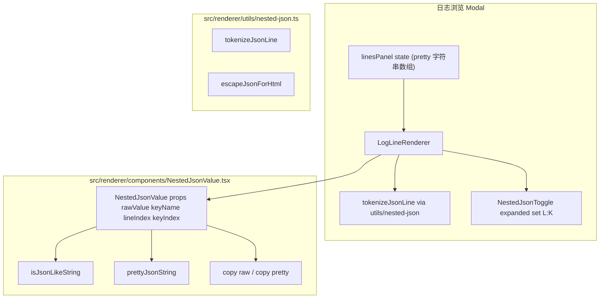

<!-- 创建时间: 2026-06-27 09:35 -->
<!-- 最后修改: 2026-06-27 09:35 -->

# 架构设计文档 — 日志嵌套 JSON 展示（方案 D）

## 1. 范围

- 模块：`ServerDetailPage` 的日志浏览 Modal
- 仅前端；不动主进程 / IPC / preload
- 不引入新依赖

## 2. 分层

| 层 | 文件 | 职责 |
|----|------|------|
| 工具层 | `src/renderer/utils/nested-json.ts` | 纯函数：识别 / pretty / tokenize / 安全转义 |
| 组件层 | `src/renderer/components/NestedJsonValue.tsx` | 就地折叠/展开本体 + 复制按钮 |
| 组件层 | `src/renderer/components/LogLineRenderer.tsx` | 单行 token 化渲染（命中点交给 NestedJsonValue） |
| 集成层 | `src/renderer/pages/ServerDetailPage.tsx` | 状态机 + 接入新组件 |
| 测试 | `tests/nested-json.test.ts`（新增） | utils 单测 |
| 样式 | 内联 CSS Module / 局部 `<style>` | 折叠、弹层视觉 |

## 3. 架构图



## 4. 数据流

```
log:read (chunk) → add chunk → split lines → formatJsonLine each line → set linesPanel
                                                              │
                                                              ▼
                          LogLineRenderer(line) → tokenizeJsonLine(rawLine)
                                              → 命中点 <NestedJsonValue>
                                              → 命中点展开态显示 pretty + 复制按钮
```

## 5. 状态

| 字段 | 位置 | 类型 | 说明 |
|------|------|------|------|
| `expandedNestedKeys` | ServerDetailPage | `Set<string>` | 形态 `L:K`（lineIndex:keyIndex）；keyIndex 在 tokenize 时按"命中顺序"分配，0..N |
| `lines` | ServerDetailPage | `string[]` | 已 pretty 的行文本（保持原 `logContent` 行为，迁移或并列二选一，见 SP-03） |

## 6. 模块交互表

| 调用方 | 被调用方 | 通信方式 | 接口 |
|--------|---------|---------|------|
| LogLineRenderer | utils/nested-json | ESM import | `tokenizeJsonLine(rawLine): JsonToken[]` |
| NestedJsonValue | utils/nested-json | ESM import | `isJsonLikeString` / `prettyJsonString` / `escapeJsonForHtml` |
| NestedJsonValue | 浏览器 | `navigator.clipboard.writeText` / `document.execCommand('copy')` 回退 | — |
| ServerDetailPage | NestedJsonValue | React props | 同 §技术 |

## 7. 性能预算

- 单行 tokenize：`< 2ms`（depth=1，raw value < 16KB）
- Pretty：`< 2ms`
- 命中检测（isJsonLikeString）：`< 0.2ms` per string
- 1000 行滚动：长任务 ≥ 50ms = 0

## 8. 安全

- 所有展示用 `<pre>` 文本节点或转义后 HTML，不直接拼接 JSON 字符串到 `dangerouslySetInnerHTML`
- 复制使用浏览器剪贴板 API；失败 fallback 不留副作用

## 9. 部署与环境

无变化（Electron 桌面应用，本机运行）。
