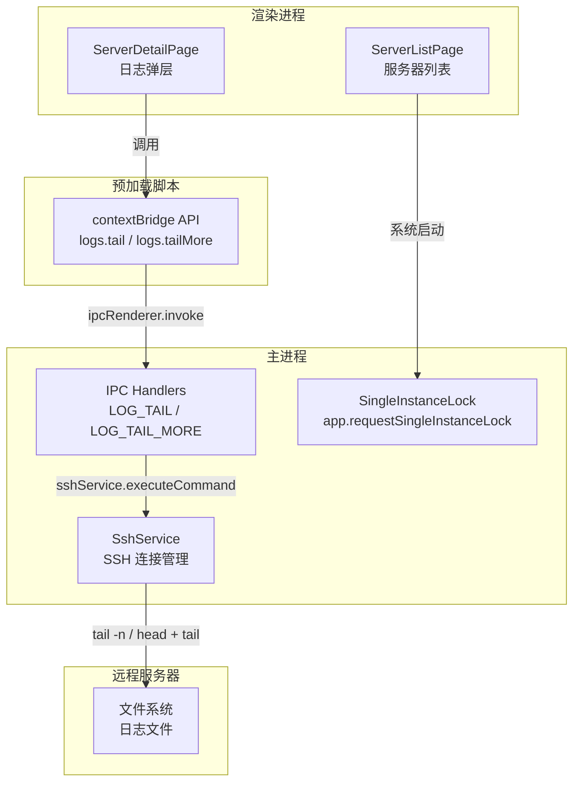

<!-- 创建时间: 2026-07-12 11:30 -->
<!-- 最后修改: 2026-07-12 11:30 -->

# 架构设计文档 — 日志尾部浏览 & 单实例锁

## 变更概述
本次对现有 Electron + React + SSH 架构做两个增量修改，不改变整体分层结构。

## 架构图

## 模块划分
| 模块 | 职责 | 技术选型 | 选型理由 |
|------|------|---------|---------|
| 日志尾部浏览 | 从远程文件末尾读取 N 行，支持向上翻页加载更早内容 | SSH + `tail`/`head` 命令 | SSH 已打通，无需额外依赖 |
| 单实例锁 | 防止 Electron 多开，后续实例聚焦已有窗口 | Electron `app.requestSingleInstanceLock` | 官方标准 API |
| IPC 通道 | 新增 `logs:tail` / `logs:tailMore` | Electron ipcMain/ipcRenderer | 与现有模式一致 |
| Preload API | 暴露 `logs.tail` / `logs.tailMore` | contextBridge | 安全隔离 |

## 部署方案
桌面应用，无部署变更。

## 模块间交互关系
| 调用方 | 被调用方 | 通信方式 | 接口协议 |
|--------|---------|---------|---------|
| ServerDetailPage | preload.logs.tail | IPC invoke | `(serverId, filePath, nLines) => string` |
| ServerDetailPage | preload.logs.tailMore | IPC invoke | `(serverId, filePath, beforeLine, nLines) => string` |
| app.whenReady | app.requestSingleInstanceLock | 直接调用 | 返回 boolean |
| 后续实例 | 已有窗口 | second-instance 事件 | focus/restore |
