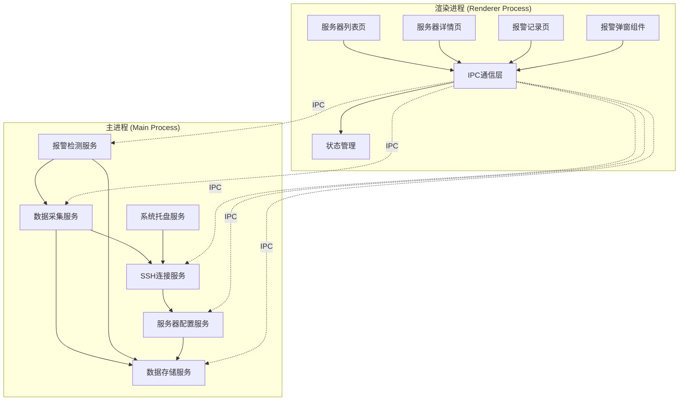
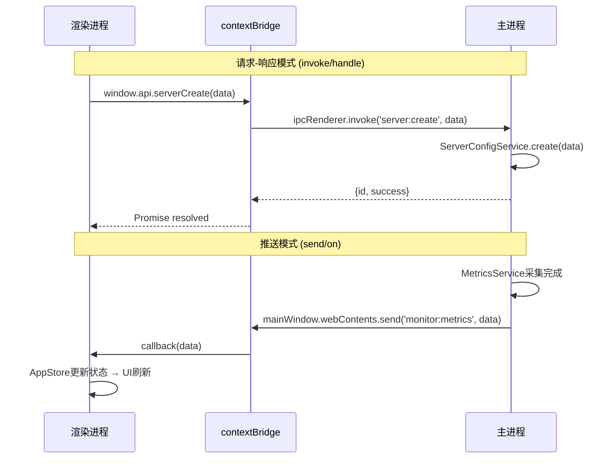
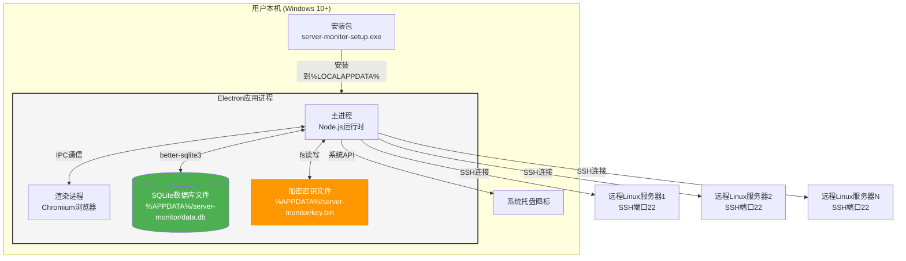
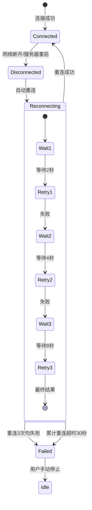
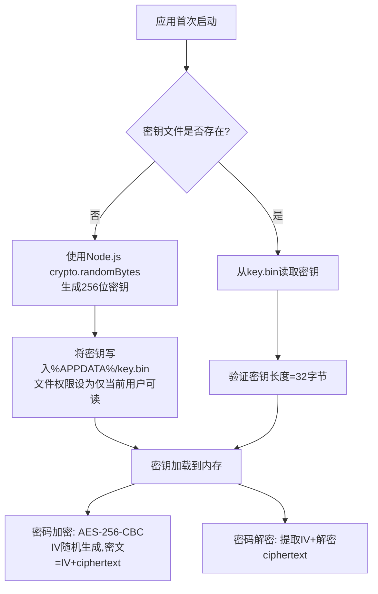
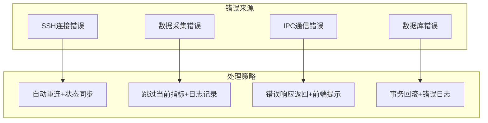
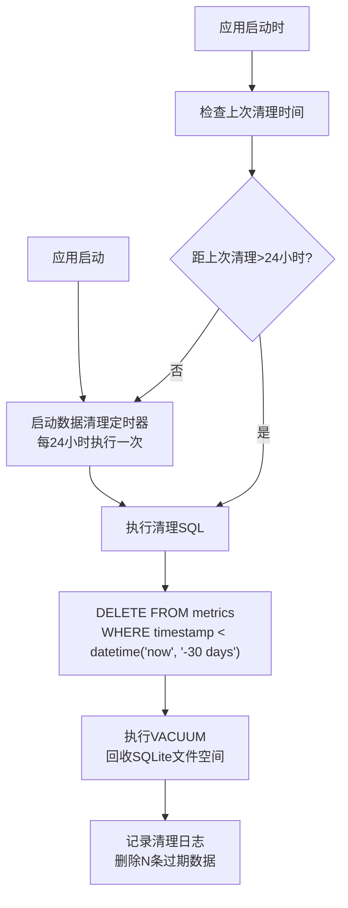

# Server Monitor - 架构设计文档

## 1. 架构风格与选型

### 1.1 架构风格

本项目采用 **Electron桌面应用双层架构**：主进程（Main Process）+ 渲染进程（Renderer Process），通过IPC通信解耦。

- **主进程**：Node.js运行时，负责系统级操作——SSH连接管理、数据采集、报警检测、SQLite数据库读写、系统托盘管理
- **渲染进程**：Chromium浏览器环境，负责UI渲染与用户交互——React组件树、路由管理、图表展示
- **通信层**：Electron IPC（`ipcMain`/`ipcRenderer`），作为两层之间的唯一数据通道

此架构风格的选择基于以下考量：

| 考量维度 | 说明 |
|---------|------|
| 系统级API需求 | SSH连接、文件系统访问、系统托盘等均需Node.js运行时，只能在主进程完成 |
| UI体验需求 | 卡片布局、动画、图表交互需要现代浏览器渲染能力，只能在渲染进程完成 |
| 安全隔离 | 渲染进程不直接访问文件系统和网络，所有敏感操作通过IPC委托主进程执行 |
| 单用户桌面场景 | 无需服务端，本地SQLite即可满足数据持久化需求 |

> 对应终态：1.项目概述（本地Windows桌面应用）、3.后端终态（Electron IPC通信）

### 1.2 技术栈选型及理由

| 技术 | 选型理由 |
|------|---------|
| **Electron** | 唯一成熟的支持系统级API（SSH、文件系统、托盘）+ 现代Web UI的桌面应用框架。对应终态：1.项目概述（Windows桌面应用）、3.6系统托盘服务 |
| **React 18** | 组件化开发模型天然适配卡片式UI布局，Concurrent Mode提升指标实时更新渲染性能，生态成熟（Ant Design/Recharts均为React生态）。对应终态：2.前端终态（卡片网格布局、实时指标刷新） |
| **Vite** | 开发时HMR速度远超Webpack（基于ESM），生产构建基于Rollup体积更小。对于Electron项目，Vite的快速冷启动显著提升开发体验。对应终态：6.非功能性终态（应用启动时间<3秒） |
| **TypeScript** | 静态类型系统保障IPC通信两端的数据契约一致性，避免渲染进程与主进程之间的序列化/反序列化错误。对应终态：3.2 API完整列表（IPC请求参数与响应格式的类型约束） |
| **SQLite** | 零配置嵌入式数据库，数据存储在本地文件中，无需独立数据库进程，适合单用户桌面场景。对应终态：4.1数据库表设计（3表结构）、6.非功能性终态（内存占用<300MB） |
| **Recharts** | 基于React和D3的声明式图表库，与React组件模型深度集成，支持折线图/面积图/响应式布局。对应终态：2.2服务器监控详情页（CPU/内存折线图、磁盘面积图、网络折线图） |
| **ssh2** | Node.js生态中最成熟的SSH2协议实现，纯JavaScript实现无需原生编译依赖，支持密码和私钥两种认证方式。对应终态：2.1服务器配置表单（密码/密钥认证）、3.1 SSH连接服务 |
| **Ant Design** | 企业级React UI组件库，提供Table/Form/Modal/Card/Select等开箱即用组件，与本项目表单密集、数据展示密集的UI需求高度匹配。对应终态：2.1服务器列表页（卡片+表单弹窗）、2.3报警记录页（筛选+分页表格） |

### 1.3 架构决策记录(ADR)

#### ADR-01: 选择Electron而非Tauri作为桌面框架

**Context**：用户最初考虑使用Next.js并包装为Windows桌面应用。需要在Electron和Tauri之间做出选择，两者均支持Web技术栈构建桌面应用。

**Decision**：选择Electron。

**Consequences**：
- 优势：Node.js运行时完整可用，ssh2等Node库无需任何适配即可在主进程运行；系统托盘、文件对话框等API开箱即用；社区生态成熟，electron-builder打包工具链完善
- 劣势：安装包体积较大（Chromium+Node.js打包，约80MB，对应终态6.非功能性终态安装包<80MB）；内存占用高于Tauri（需控制在300MB以内，对应终态6.非功能性终态）
- 对应终态：1.项目概述（electron-builder打包为exe）、3.1 SSH连接服务（依赖Node.js运行时）

#### ADR-02: 选择SQLite而非IndexedDB/LevelDB作为本地存储

**Context**：桌面应用需要持久化服务器配置、监控指标和报警记录。可选方案包括SQLite、IndexedDB、LevelDB。

**Decision**：选择SQLite（通过better-sqlite3集成）。

**Consequences**：
- 优势：SQL查询能力强，支持复杂聚合查询（趋势图需要按时间范围聚合指标）；关系型约束保障数据一致性（server_id外键关联）；单文件存储便于备份和迁移；better-sqlite3为同步API，在主进程中使用无需async/await复杂度
- 劣势：better-sqlite3包含原生模块，electron-builder打包时需配置native模块rebuild
- 对应终态：4.1数据库表设计（3表关系型结构）、4.3数据使用方式（趋势图表需按时间范围Read历史记录）

#### ADR-03: 选择IPC通信而非remote模块

**Context**：渲染进程需要访问主进程能力（SSH连接、数据库操作等）。Electron历史上提供`remote`模块允许渲染进程直接调用主进程对象，但存在安全和性能问题。

**Decision**：使用`contextBridge` + `ipcRenderer.invoke`/`ipcMain.handle`的IPC通信模式，禁用`remote`模块和`nodeIntegration`。

**Consequences**：
- 优势：渲染进程无Node.js访问权限，即使加载远程内容也不会泄露系统级能力；`invoke/handle`模式自带Promise语义，天然支持请求-响应模式；通过`contextBridge`暴露的白名单API，攻击面最小化
- 劣势：所有主进程操作需显式定义IPC通道和参数类型，开发工作量略高；大量数据传输（如历史指标）需注意序列化开销
- 对应终态：3.2 API完整列表（12个IPC通道定义）、6.非功能性终态（密码AES-256加密存储）

#### ADR-04: 选择ssh2而非node-ssh/pty.js

**Context**：需要通过SSH连接远程Linux服务器执行监控命令。可选方案包括ssh2、node-ssh（ssh2的上层封装）、pty.js。

**Decision**：选择ssh2。

**Consequences**：
- 优势：底层SSH2协议完整实现，支持连接池、流式输出、SFTP等高级能力；社区维护活跃，npm下载量最高；无需原生编译依赖，跨平台构建简单；可精细控制连接超时、保活心跳、重连策略
- 劣势：API偏底层，需自行封装连接管理和命令执行逻辑；不支持PTY伪终端（但本项目仅需执行命令获取输出，无需PTY）
- 对应终态：3.1 SSH连接服务（连接生命周期管理）、6.非功能性终态（SSH连接超时10秒）

#### ADR-05: 选择Vite而非Webpack作为构建工具

**Context**：Electron项目需要构建渲染进程的前端代码。Vite和Webpack均可配合electron-builder使用。

**Decision**：选择Vite作为渲染进程构建工具，搭配electron-vite脚手架整合主进程和渲染进程构建。

**Consequences**：
- 优势：开发服务器冷启动<300ms（基于ESM按需编译），HMR响应<50ms；生产构建基于Rollup，tree-shaking效果优于Webpack；配置简洁，无需手动配置loader/plugin
- 劣势：electron-vitest相对年轻，社区资源不如electron-webpack丰富；部分Webpack专属插件不可用（但本项目不需要）
- 对应终态：1.项目概述（Vite技术栈）、6.非功能性终态（应用启动时间<3秒）

---

## 2. 模块划分

### 2.1 模块列表与职责

#### 主进程模块（6个核心服务）

| 模块名称 | 职责 | 关键能力 | 对应终态 |
|---------|------|---------|---------|
| **SSH连接服务** (SshService) | 管理与远程Linux服务器的SSH连接生命周期 | 建立连接、断开连接、连接保活、自动重连、连接池管理 | 3.1 SSH连接服务 |
| **数据采集服务** (MetricsService) | 按配置周期通过SSH执行命令采集CPU/内存/磁盘/网络指标 | 定时任务调度、命令执行与输出解析、指标数据结构化 | 3.1 数据采集服务 |
| **报警检测服务** (AlertService) | 检测采集指标是否超过配置阈值，触发报警通知 | 阈值比对、去重判断（BR-1）、报警创建、恢复检测（BR-6） | 3.1 报警检测服务 |
| **数据存储服务** (StorageService) | 管理SQLite数据库的读写和数据生命周期 | CRUD操作、事务管理、数据清理（BR-4）、数据库初始化与迁移 | 3.1 数据存储服务 |
| **服务器配置服务** (ServerConfigService) | 管理服务器配置的CRUD操作 | 服务器添加/编辑/删除、密码加密/解密、配置校验 | 3.1 服务器配置服务 |
| **系统托盘服务** (TrayService) | 管理系统托盘图标、右键菜单和窗口行为 | 托盘图标创建/更新、最小化到托盘、托盘菜单操作、退出应用 | 3.1 系统托盘服务 |

#### 渲染进程模块

| 模块名称 | 职责 | 关键能力 | 对应终态 |
|---------|------|---------|---------|
| **服务器列表页** (ServerList) | 展示所有已配置服务器卡片，提供全局操作入口 | 卡片网格布局、实时指标展示、迷你趋势图、添加/编辑/删除弹窗 | 2.1 服务器列表页 |
| **服务器详情页** (ServerDetail) | 展示单台服务器详细监控数据和趋势图表 | 四指标趋势图（Recharts）、时间范围切换、报警记录子表 | 2.2 服务器监控详情页 |
| **报警记录页** (AlertRecords) | 展示所有服务器历史报警记录 | 多维筛选、分页表格、批量操作 | 2.3 报警记录页 |
| **报警弹窗组件** (AlertPopup) | 应用内报警通知弹窗 | 弹窗展示、查看详情跳转、忽略操作 | 2.4 应用内报警弹窗 |
| **IPC通信层** (IpcBridge) | 封装渲染进程与主进程的IPC通信 | 类型安全的IPC调用封装、实时指标监听、报警通知监听 | 3.2 API完整列表 |
| **状态管理** (AppStore) | 管理应用全局状态 | 服务器列表状态、当前监控指标、报警列表、UI状态 | 2.1-2.4 全页面状态 |

### 2.2 模块间依赖关系



**依赖关系说明**：

| 依赖关系 | 依赖原因 |
|---------|---------|
| 数据采集服务 → SSH连接服务 | 采集指标需要通过SSH连接执行远程命令 |
| 报警检测服务 → 数据采集服务 | 报警检测依赖采集到的最新指标值 |
| 数据采集服务 → 数据存储服务 | 采集到的指标需持久化到SQLite |
| 报警检测服务 → 数据存储服务 | 报警记录需写入SQLite，且需查询是否已有active报警（BR-1） |
| 服务器配置服务 → 数据存储服务 | 配置的CRUD操作通过数据存储服务完成 |
| SSH连接服务 → 服务器配置服务 | 建立连接时需读取服务器IP/端口/凭据配置 |
| 系统托盘服务 → SSH连接服务 | 退出应用时需通过SSH连接服务断开所有连接（BR-5） |

### 2.3 模块间通信方式

渲染进程与主进程之间通过Electron IPC通信，所有IPC通道定义如下：

#### 请求-响应通道（渲染进程 → 主进程）

| IPC通道 | 功能 | 请求参数 | 响应格式 | 对应终态 |
|---------|------|---------|---------|---------|
| `server:create` | 添加服务器配置 | `{name, ip, port, username, authType, password, privateKeyPath, monitorInterval, monitorItems, thresholds}` | `{id, success}` | 3.2 API列表 |
| `server:update` | 更新服务器配置 | `{id, ...updates}` | `{success}` | 3.2 API列表 |
| `server:delete` | 删除服务器 | `{id}` | `{success}` | 3.2 API列表 |
| `server:list` | 获取服务器列表 | `{}` | `[{id, name, ip, status, ...}]` | 3.2 API列表 |
| `server:getDetail` | 获取服务器详情 | `{id}` | `{id, name, ip, config, currentMetrics}` | 3.2 API列表 |
| `monitor:start` | 启动监控 | `{serverId}` | `{success}` | 3.2 API列表 |
| `monitor:stop` | 停止监控 | `{serverId}` | `{success}` | 3.2 API列表 |
| `monitor:getHistory` | 获取历史数据 | `{serverId, metricType, timeRange}` | `[{timestamp, value}]` | 3.2 API列表 |
| `alert:list` | 获取报警记录 | `{serverId?, alertType?, timeRange?, page, pageSize}` | `{total, list: [{...}]}` | 3.2 API列表 |
| `alert:dismiss` | 忽略报警 | `{alertId}` | `{success}` | 3.2 API列表 |

#### 推送通道（主进程 → 渲染进程）

| IPC通道 | 功能 | 推送数据格式 | 触发时机 | 对应终态 |
|---------|------|-------------|---------|---------|
| `monitor:metrics` | 推送实时指标 | `{serverId, cpu, memory, disk, network}` | 每个采集周期完成后 | 3.2 API列表 |
| `alert:notification` | 推送报警通知 | `{serverId, alertType, currentValue, threshold, timestamp}` | 指标超阈值时 | 3.2 API列表 |

#### 通信实现模式



> 对应终态：3.2 API完整列表（12个IPC通道）、3.3后端处理链路（启动监控/数据采集/报警触发流程）

---

## 3. 部署架构

### 3.1 部署拓扑

本项目为本地Windows桌面应用，部署拓扑仅涉及用户本机：



**关键路径说明**：

| 路径 | 用途 |
|------|------|
| `%APPDATA%/server-monitor/data.db` | SQLite数据库文件，存储所有业务数据 |
| `%APPDATA%/server-monitor/key.bin` | AES-256加密密钥，用于SSH密码加密存储 |
| `%LOCALAPPDATA%/server-monitor/` | 应用安装目录 |
| `%APPDATA%/server-monitor/logs/` | 应用日志目录 |

> 对应终态：1.项目概述（Windows桌面应用）、6.非功能性终态（Windows 10+、AES-256加密）

### 3.2 环境规划

#### 开发环境

| 配置项 | 值 |
|--------|-----|
| Node.js | >= 18.x LTS |
| 包管理器 | npm |
| 构建工具 | electron-vite（整合Vite + Electron构建） |
| 开发命令 | `npm run dev`（启动electron-vite dev模式，HMR热更新） |
| 数据库位置 | `./dev-data/data.db`（项目根目录下开发数据） |
| 调试方式 | Chrome DevTools（渲染进程）+ VS Code调试（主进程） |
| 热重载 | 渲染进程Vite HMR，主进程需手动重启 |

#### 生产构建

| 配置项 | 值 |
|--------|-----|
| 构建命令 | `npm run build` |
| 打包工具 | electron-builder |
| 输出格式 | NSIS安装包（server-monitor-setup.exe） |
| 安装模式 | 用户级安装（无需管理员权限） |
| 自动更新 | 不支持（v1.0不包含自动更新功能） |
| 数据库位置 | `%APPDATA%/server-monitor/data.db` |
| 代码签名 | 可选（无代码签名时Windows SmartScreen会提示未知发布者） |

> 对应终态：1.项目概述（electron-builder打包为exe安装包）、6.非功能性终态（安装包<80MB）

### 3.3 高可用与扩展性方案

#### SSH连接错误恢复



| 策略 | 说明 | 对应终态 |
|------|------|---------|
| 自动重连 | SSH连接断开后采用指数退避策略重连（2s→4s→8s），最多3次 | 3.1 SSH连接服务、5.1服务器状态流转（error→monitoring） |
| 连接保活 | 每30秒发送SSH keepalive包，防止空闲连接被服务器断开 | 3.1 SSH连接服务 |
| 连接超时 | 建立连接超时10秒，命令执行超时5秒 | 6.非功能性终态（SSH连接超时10秒） |
| 状态同步 | 连接状态变更时通过IPC推送`monitor:status`到渲染进程，UI实时反映连接状态 | 3.2 API列表、5.1服务器状态流转 |

#### 数据采集错误处理

| 策略 | 说明 | 对应终态 |
|------|------|---------|
| 命令执行超时 | 单条命令执行超过5秒则终止，记录错误日志但不中断整个采集周期 | 3.1 数据采集服务 |
| 解析失败容错 | 命令输出解析失败时记录原始输出和错误信息，该指标标记为NaN，不阻塞其他指标采集 | 3.1 数据采集服务 |
| 采集任务隔离 | 每台服务器的采集任务独立运行，单台服务器采集异常不影响其他服务器 | 6.非功能性终态（同时监控20台） |

#### 应用崩溃恢复

| 策略 | 说明 | 对应终态 |
|------|------|---------|
| 渲染进程崩溃 | 主进程监听`render-process-gone`事件，自动重新创建BrowserWindow并恢复页面 | 系统稳定性保障 |
| 主进程崩溃 | 系统托盘图标丢失，用户需重新启动应用；SQLite的WAL模式保障数据库不损坏 | 数据存储安全 |
| 数据库损坏 | 应用启动时执行`PRAGMA integrity_check`，损坏时从备份恢复或重建空库 | 数据存储安全 |
| 优雅退出 | 监听`will-quit`事件，断开所有SSH连接（BR-5）、关闭数据库连接、清理定时器 | 5.2业务规则BR-5 |

> 对应终态：3.1 SSH连接服务、5.1核心业务对象生命周期、5.2业务规则BR-5、6.非功能性终态

---

## 4. 交叉关注点

### 4.1 安全方案

#### AES-256密码加密

SSH密码在SQLite中以AES-256-CBC加密存储，防止明文泄露。

**密钥管理流程**：



| 安全措施 | 说明 | 对应终态 |
|---------|------|---------|
| AES-256-CBC加密 | SSH密码加密后以`IV:ciphertext`格式存储在servers表password_encrypted字段 | 4.1 servers表、5.2 BR-2 |
| 随机IV | 每次加密使用`crypto.randomBytes(16)`生成随机IV，相同密码产生不同密文 | 5.2 BR-2 |
| 密钥文件权限 | Windows下设置key.bin文件ACL仅当前用户可读 | 6.非功能性终态（AES-256加密） |
| 密钥不进入数据库 | 加密密钥存储在独立文件中，与数据库物理隔离 | 安全最佳实践 |
| 私钥文件路径存储 | SSH私钥仅存储文件路径，不读取私钥内容到数据库 | 4.1 servers表private_key_path字段 |

#### 渲染进程安全

| 安全措施 | 说明 | 对应终态 |
|---------|------|---------|
| nodeIntegration: false | 渲染进程不加载Node.js运行时，无法直接访问文件系统 | ADR-03 |
| contextIsolation: true | contextBridge暴露的API与渲染进程全局作用域隔离 | ADR-03 |
| sandbox: true | 渲染进程运行在Chromium沙箱中 | ADR-03 |
| 白名单API | contextBridge仅暴露已声明的IPC方法，不暴露ipcRenderer原始对象 | ADR-03 |

#### IPC通道安全

| 安全措施 | 说明 |
|---------|------|
| 通道名命名空间 | 所有通道以`server:`/`monitor:`/`alert:`前缀区分，主进程仅监听已注册通道 |
| 参数校验 | 主进程IPC handler对请求参数做运行时类型校验（TypeScript编译时 + 运行时双重保障） |
| 来源验证 | 主进程通过`event.sender`验证IPC来源为合法渲染进程 |

> 对应终态：4.1 servers表（password_encrypted字段）、5.2 BR-2（AES加密存储）、6.非功能性终态（AES-256加密）

### 4.2 日志方案

使用 **electron-log** 作为日志框架，统一管理主进程和渲染进程日志。

**日志配置**：

| 配置项 | 值 | 说明 |
|--------|-----|------|
| 日志框架 | electron-log | Electron生态最成熟的日志方案，支持多传输目标 |
| 日志级别 | error / warn / info / debug | 生产环境输出warn及以上，开发环境输出debug及以上 |
| 日志文件位置 | `%APPDATA%/server-monitor/logs/main.log` | 主进程日志 |
| 日志文件位置 | `%APPDATA%/server-monitor/logs/renderer.log` | 渲染进程日志 |
| 日志轮转 | 单文件最大5MB，保留最近5个文件 | 防止日志文件无限增长 |
| 日志格式 | `[2026-05-24 10:30:00.123] [INFO] [SshService] 连接建立成功: 192.168.1.100` | 时间戳 + 级别 + 模块名 + 消息 |

**各模块日志要点**：

| 模块 | 关键日志事件 | 日志级别 |
|------|-------------|---------|
| SSH连接服务 | 连接建立/断开/重连/认证失败/超时 | info / warn / error |
| 数据采集服务 | 采集开始/完成/命令执行失败/解析失败 | info / warn / error |
| 报警检测服务 | 报警触发/恢复/去重跳过 | info / warn |
| 数据存储服务 | 数据库初始化/迁移/清理/完整性检查 | info / warn / error |
| 服务器配置服务 | 配置创建/更新/删除/密码加密操作 | info |
| 系统托盘服务 | 托盘创建/点击事件/退出请求 | info |

> 对应终态：3.1 六大后端服务（日志覆盖所有服务关键事件）、6.非功能性终态（内存占用控制-日志轮转防膨胀）

### 4.3 错误处理策略

#### 错误分类与处理矩阵



#### SSH连接错误

| 错误场景 | 错误码/标识 | 处理策略 | 用户感知 | 对应终态 |
|---------|------------|---------|---------|---------|
| 网络不可达 | ECONNREFUSED / ETIMEDOUT | 自动重连（指数退避2s→4s→8s，最多3次） | 服务器卡片状态变为error，显示"连接失败" | 3.1 SSH连接服务、5.1状态流转 |
| 认证失败 | EAUTH | 不重连，标记error状态，通知渲染进程 | 弹出提示"认证失败，请检查用户名/密码" | 5.1状态流转（monitoring→error） |
| 连接被拒 | ECONNRESET | 自动重连 | 服务器卡片状态变为error后尝试恢复 | 3.1 SSH连接服务 |
| 主机密钥变更 | EKEYCHANGE | 不重连，标记error状态，提示安全风险 | 弹出警告"服务器主机密钥已变更，可能存在安全风险" | 安全方案 |
| 连接超时 | 超过10秒无响应 | 终止连接尝试，标记error | 显示"连接超时" | 6.非功能性终态（10秒超时） |

#### 数据采集错误

| 错误场景 | 处理策略 | 用户感知 | 对应终态 |
|---------|---------|---------|---------|
| 命令执行超时（>5秒） | 终止命令，该指标标记为NaN，继续下一个指标采集 | 对应图表显示"--"或跳过该时间点 | 3.1 数据采集服务 |
| 命令输出解析失败 | 记录原始输出到日志，该指标标记为NaN | 对应图表显示"--"或跳过该时间点 | 3.1 数据采集服务 |
| SSH连接在采集中断开 | 暂停采集任务，触发SSH重连流程，重连成功后恢复采集 | 服务器卡片短暂显示error状态后恢复 | 3.1 数据采集服务 |
| 指标值异常（如CPU>100%） | 采集值校验，超出合理范围的值不写入数据库 | 图表不显示异常点 | 数据质量保障 |

#### IPC通信错误

| 错误场景 | 处理策略 | 用户感知 | 对应终态 |
|---------|---------|---------|---------|
| 主进程handler异常 | invoke返回rejected Promise，渲染进程catch处理 | 弹出Ant Design Message错误提示 | 3.2 API列表 |
| 渲染进程未响应推送 | 主进程检查`webContents.isDestroyed()`，若已销毁则停止推送 | 无感知（窗口已关闭） | 系统稳定性 |
| 参数校验失败 | 主进程返回`{success: false, error: 'INVALID_PARAMS'}` | 弹出提示"参数错误" | ADR-03 |
| 序列化失败 | 循环引用或不可序列化对象传入IPC | 主进程catch序列化错误，返回通用错误 | 系统稳定性 |

> 对应终态：3.1 六大后端服务、3.3后端处理链路、5.1服务器状态流转、6.非功能性终态

### 4.4 数据清理策略

按照业务规则BR-4，超过30天的metrics数据自动清理，避免SQLite数据库文件无限膨胀。

**清理机制设计**：



**清理策略详情**：

| 策略项 | 配置 | 说明 | 对应终态 |
|--------|-----|------|---------|
| 清理目标 | metrics表 | 仅清理指标数据，servers和alerts表不自动清理 | 5.2 BR-4 |
| 保留天数 | 默认30天，可通过应用设置调整 | 平衡存储空间与历史数据可用性 | 5.2 BR-4、6.非功能性终态 |
| 清理频率 | 每24小时执行一次 | 避免频繁清理影响性能 | 5.2 BR-4 |
| 清理时机 | 应用启动时检查 + 运行中每24小时 | 确保长期运行也能定期清理 | 5.2 BR-4 |
| 空间回收 | 清理后执行VACUUM | SQLite的DELETE不会自动回收文件空间，需VACUUM压缩 | 6.非功能性终态（内存/磁盘占用控制） |
| alerts清理 | 不自动清理，用户可手动批量清除30天前记录 | 报警记录具有重要性，不自动删除 | 5.3管理维度（报警记录可批量清除） |
| 数据库大小监控 | 清理后记录数据库文件大小到日志 | 当数据库超过100MB时在日志中警告 | 6.非功能性终态 |

**清理SQL语句**：

```sql
DELETE FROM metrics
WHERE timestamp < datetime('now', '-30 days');

SELECT changes();

VACUUM;
```

> 对应终态：4.1 metrics表、5.2 BR-4（30天自动清理）、5.3管理维度（报警记录批量清除）、6.非功能性终态（数据保留期默认30天）
