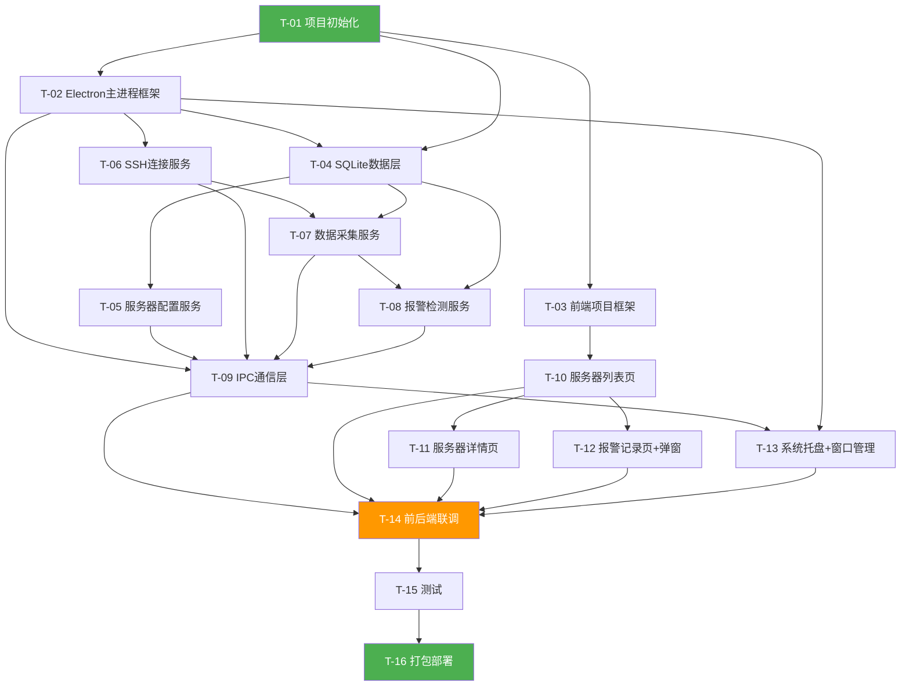

# Server Monitor - 全局执行计划

## 1. 计划概览

| 属性 | 值 |
|------|-----|
| 任务总数 | 16 |
| 阶段划分 | 基础设施(3) / 数据层(2) / 主进程服务(4) / 前端页面(4) / 集成联调(1) / 测试(1) / 部署(1) |
| 关键路径 | T-01→T-02→T-04→T-06→T-09→T-12→T-14→T-15→T-16 |

## 2. 任务依赖关系图

## 3. 任务详情

### T-01: 项目初始化

**所属阶段**：基础设施
**前置依赖**：无
**输出产物**：项目目录结构、package.json、tsconfig.json、Vite配置、ESLint/Prettier配置
**下游依赖方**：T-02, T-03, T-04
**执行Agent**：前端开发Agent
**验收标准**：`npm install`成功，`npm run dev`启动无报错，目录结构符合开发规范文档
**预估复杂度**：低
**关联终态项**：开发规范文档-1.项目结构规范

### T-02: Electron主进程框架

**所属阶段**：基础设施
**前置依赖**：T-01
**输出产物**：`src/main/index.ts`（主进程入口）、`src/main/preload.ts`（预加载脚本）、BrowserWindow创建逻辑
**下游依赖方**：T-04, T-06, T-09, T-13
**执行Agent**：前端开发Agent
**验收标准**：Electron窗口正常打开，渲染进程加载Vite dev server页面，preload脚本contextBridge可用
**预估复杂度**：中
**关联终态项**：架构设计文档-2.模块划分（主进程+渲染进程双层架构）

### T-03: 前端项目框架

**所属阶段**：基础设施
**前置依赖**：T-01
**输出产物**：React App入口、React Router配置、Ant Design主题配置、全局Layout组件（TitleBar+内容区+状态栏）
**下游依赖方**：T-10, T-11, T-12
**执行Agent**：前端开发Agent
**验收标准**：浏览器访问显示Layout骨架，路由切换正常，Ant Design组件正常渲染
**预估复杂度**：低
**关联终态项**：2.1/2.2/2.3 页面线框图中的顶部标题栏和底部状态栏

### T-04: SQLite数据层

**所属阶段**：数据层
**前置依赖**：T-01, T-02
**输出产物**：`src/main/database/`目录（schema初始化、DataService类、迁移机制）、加密工具类`src/main/utils/crypto.ts`
**下游依赖方**：T-05, T-07, T-08
**执行Agent**：前端开发Agent
**验收标准**：DataService可创建/查询servers、metrics、alerts表，密码AES加密/解密正确，schema_version记录正常
**预估复杂度**：中
**关联终态项**：4.1 数据库表设计 / 5.2 BR-2密码加密

### T-05: 服务器配置服务

**所属阶段**：主进程服务
**前置依赖**：T-04
**输出产物**：`src/main/services/ServerConfigService.ts`
**下游依赖方**：T-09
**执行Agent**：前端开发Agent
**验收标准**：createServer/updateServer/deleteServer/listServers/getServer全部CRUD操作正确，密码存储为密文
**预估复杂度**：低
**关联终态项**：3.1 服务器配置服务 / 3.2 server:create/update/delete/list/getDetail

### T-06: SSH连接服务

**所属阶段**：主进程服务
**前置依赖**：T-02
**输出产物**：`src/main/services/SshService.ts`
**下游依赖方**：T-07, T-09
**执行Agent**：前端开发Agent
**验收标准**：可连接远程Linux服务器、执行命令并返回输出、连接失败返回错误码、disconnect断开连接
**预估复杂度**：高
**关联终态项**：3.1 SSH连接服务 / 3.3 启动监控流程

### T-07: 数据采集服务

**所属阶段**：主进程服务
**前置依赖**：T-04, T-06
**输出产物**：`src/main/services/CollectService.ts`
**下游依赖方**：T-08, T-09
**执行Agent**：前端开发Agent
**验收标准**：startMonitoring/stopMonitoring正常工作，CPU/内存/磁盘/网络4种指标可通过SSH命令采集并解析出数值，定时器按配置周期触发
**预估复杂度**：高
**关联终态项**：3.1 数据采集服务 / 3.3 数据采集流程 / 技术设计文档-4.1 SSH数据采集流程

### T-08: 报警检测服务

**所属阶段**：主进程服务
**前置依赖**：T-04, T-07
**输出产物**：`src/main/services/AlertService.ts`
**下游依赖方**：T-09
**执行Agent**：前端开发Agent
**验收标准**：指标超阈值时创建active报警，同一指标不重复报警（BR-1），指标回落自动恢复（BR-6），listAlerts/dismissAlert正常工作
**预估复杂度**：中
**关联终态项**：3.1 报警检测服务 / 5.2 BR-1/BR-6 / 技术设计文档-4.2 报警检测算法

### T-09: IPC通信层

**所属阶段**：主进程服务
**前置依赖**：T-02, T-05, T-06, T-07, T-08
**输出产物**：`src/main/ipc/`目录（所有IPC handler注册）、`src/shared/types.ts`（共享类型）、`src/shared/channels.ts`（通道常量）
**下游依赖方**：T-13, T-14
**执行Agent**：前端开发Agent
**验收标准**：12个IPC通道全部注册，渲染进程可调用所有通道并收到正确响应，主→渲染推送通道正常工作
**预估复杂度**：中
**关联终态项**：3.2 API完整列表（12个IPC通道）

### T-10: 服务器列表页

**所属阶段**：前端页面
**前置依赖**：T-03
**输出产物**：`src/renderer/pages/ServerListPage.tsx`、`src/renderer/components/ServerCard.tsx`、`src/renderer/components/ServerFormModal.tsx`、`src/renderer/components/MiniChart.tsx`、`src/renderer/components/SearchBar.tsx`
**下游依赖方**：T-11, T-12, T-14
**执行Agent**：前端开发Agent
**验收标准**：服务器卡片网格展示、添加/编辑弹窗表单校验正常、搜索过滤正常、迷你趋势图渲染正常
**预估复杂度**：中
**关联终态项**：2.1 服务器列表页（线框图+交互元素+表单详情）

### T-11: 服务器监控详情页

**所属阶段**：前端页面
**前置依赖**：T-10
**输出产物**：`src/renderer/pages/ServerDetailPage.tsx`、`src/renderer/components/TrendChart.tsx`、`src/renderer/components/TimeRangeSelector.tsx`、`src/renderer/components/RealtimeBar.tsx`、`src/renderer/components/AlertTable.tsx`
**下游依赖方**：T-14
**执行Agent**：前端开发Agent
**验收标准**：4个趋势图表正确渲染（Recharts），时间范围切换数据刷新，实时指标条更新，报警记录表格展示
**预估复杂度**：中
**关联终态项**：2.2 服务器监控详情页（线框图+交互元素）

### T-12: 报警记录页+弹窗

**所属阶段**：前端页面
**前置依赖**：T-10
**输出产物**：`src/renderer/pages/AlertRecordsPage.tsx`、`src/renderer/components/AlertPopup.tsx`、`src/renderer/components/AlertFilter.tsx`
**下游依赖方**：T-14
**执行Agent**：前端开发Agent
**验收标准**：报警表格筛选/分页正常，报警弹窗监听`alert:notification`并弹出，查看详情跳转正确，忽略操作正常
**预估复杂度**：低
**关联终态项**：2.3 报警记录页 / 2.4 报警弹窗

### T-13: 系统托盘+窗口管理

**所属阶段**：前端页面
**前置依赖**：T-02, T-09
**输出产物**：`src/main/services/TrayService.ts`、窗口关闭行为（最小化到托盘）、开机自启配置
**下游依赖方**：T-14
**执行Agent**：前端开发Agent
**验收标准**：关闭窗口最小化到托盘、托盘右键菜单正常（显示窗口/退出）、退出时断开所有SSH连接（BR-5）
**预估复杂度**：低
**关联终态项**：3.1 系统托盘服务 / 5.2 BR-5

### T-14: 前后端联调

**所属阶段**：集成联调
**前置依赖**：T-09, T-10, T-11, T-12, T-13
**输出产物**：完整可运行的应用，所有功能打通
**下游依赖方**：T-15
**执行Agent**：前端开发Agent
**验收标准**：完整流程可走通：添加服务器→启动监控→实时数据展示→超阈值报警弹窗→查看详情→停止监控→删除服务器
**预估复杂度**：高
**关联终态项**：3.3 后端处理链路（3个完整流程）

### T-15: 测试

**所属阶段**：测试
**前置依赖**：T-14
**输出产物**：单元测试用例、集成测试结果
**下游依赖方**：T-16
**执行Agent**：测试Agent
**验收标准**：核心Service单元测试覆盖率>70%，SSH解析逻辑测试通过，报警去重/恢复逻辑测试通过
**预估复杂度**：中
**关联终态项**：5.2 业务规则（BR-1~BR-6）

### T-16: 打包部署

**所属阶段**：部署
**前置依赖**：T-15
**输出产物**：electron-builder配置、Windows安装包（exe）
**下游依赖方**：无
**执行Agent**：DevOps Agent
**验收标准**：`npm run build`生成安装包，安装后应用正常运行，安装包<80MB
**预估复杂度**：中
**关联终态项**：6.非功能性终态（安装包大小/系统要求）

## 4. 关键里程碑

| 里程碑 | 达成条件 | 对应状态 |
|--------|---------|---------|
| M1 框架就绪 | T-01/T-02/T-03完成，应用窗口可打开且前端路由正常 | 前后端骨架联通 |
| M2 数据层+服务就绪 | T-04~T-08完成，所有主进程Service可独立运行 | 后端能力完整 |
| M3 IPC联通 | T-09完成，渲染进程可调用所有主进程功能 | 前后端通信打通 |
| M4 页面完成 | T-10/T-11/T-12/T-13完成，所有UI页面渲染正常 | UI完整 |
| M5 联调通过 | T-14完成，完整监控流程可走通 | 功能完整 |
| M6 交付就绪 | T-15/T-16完成，安装包生成且测试通过 | 可交付 |

## 5. 终态覆盖矩阵

| 终态项 | 覆盖任务 | 验收标准 |
|--------|---------|---------|
| 2.1 服务器列表页 | T-03, T-10 | 卡片网格+表单弹窗+搜索+迷你图 |
| 2.2 服务器详情页 | T-11 | 4趋势图+实时指标条+报警表 |
| 2.3 报警记录页 | T-12 | 筛选+分页表格 |
| 2.4 报警弹窗 | T-12 | 弹窗通知+跳转详情 |
| 3.1 SSH连接服务 | T-06 | 连接/执行/断开 |
| 3.1 数据采集服务 | T-07 | 4指标采集+定时调度 |
| 3.1 报警检测服务 | T-08 | 阈值检测+去重+恢复 |
| 3.1 数据存储服务 | T-04 | SQLite CRUD |
| 3.1 服务器配置服务 | T-05 | 配置CRUD |
| 3.1 系统托盘服务 | T-13 | 托盘图标+菜单+退出 |
| 3.2 API完整列表 | T-09 | 12个IPC通道全部注册 |
| 3.3 启动监控流程 | T-14联调 | 完整流程走通 |
| 3.3 数据采集流程 | T-14联调 | 完整流程走通 |
| 3.3 报警触发流程 | T-14联调 | 完整流程走通 |
| 4.1 servers表 | T-04 | 表创建+CRUD |
| 4.1 metrics表 | T-04 | 表创建+写入+查询 |
| 4.1 alerts表 | T-04 | 表创建+CRUD |
| 5.2 BR-1 | T-08 | 不重复报警 |
| 5.2 BR-2 | T-04 | AES加密存储 |
| 5.2 BR-3 | T-10 | 前端校验>=5s |
| 5.2 BR-4 | T-07 | 30天自动清理 |
| 5.2 BR-5 | T-13 | 关闭时断开SSH |
| 5.2 BR-6 | T-08 | 自动恢复报警 |
| 6 非功能性终态 | T-15, T-16 | 安装包<80MB+测试通过 |
