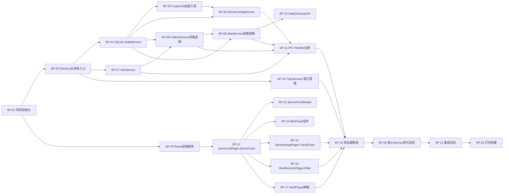

# Server Monitor - 拆分计划与进度表

## 1. 拆分概览

| 属性 | 值 |
|------|-----|
| 子计划总数 | 22 |
| 关联关系图 | 见下方 |

## 2. 子计划详情

### SP-01: 项目初始化

**所属全局任务**：T-01
**前置依赖子计划**：无
**关联子计划**：SP-02, SP-03
**输出产物**：package.json、tsconfig.json、vite.config.ts、.eslintrc.js、.prettierrc、目录结构
**执行步骤**：

| 步骤 | 操作描述 | 预期结果 |
|------|---------|---------|
| 1 | 执行`npm create vite@latest`选择React+TypeScript模板 | Vite项目创建成功 |
| 2 | 安装依赖：react-router-dom, antd, recharts, uuid | 依赖安装成功 |
| 3 | 安装Electron依赖：electron, electron-builder, electron-log, better-sqlite3, ssh2 | 依赖安装成功 |
| 4 | 安装开发依赖：@types/better-sqlite3, vitest, eslint, prettier | 依赖安装成功 |
| 5 | 创建目录结构（按开发规范文档） | 目录结构完整 |
| 6 | 配置tsconfig（main/renderer/shared三套） | TypeScript编译配置正确 |
| 7 | 配置ESLint+Prettier | lint命令可执行 |

**完成标志**：`npm run dev`启动无报错，目录结构符合规范

### SP-02: Electron主进程入口

**所属全局任务**：T-02
**前置依赖子计划**：SP-01
**关联子计划**：SP-04, SP-07, SP-18
**输出产物**：`src/main/index.ts`、`src/main/preload.ts`
**执行步骤**：

| 步骤 | 操作描述 | 预期结果 |
|------|---------|---------|
| 1 | 创建主进程入口，初始化app事件（ready/window-all-closed/activate） | Electron app生命周期正常 |
| 2 | 创建BrowserWindow，配置宽高/标题/图标/frame:false（自定义标题栏） | 窗口正常显示 |
| 3 | 创建preload.ts，使用contextBridge暴露IPC调用API | 渲染进程可通过window.electronAPI调用IPC |
| 4 | 配置Vite开发模式：主进程加载URL指向Vite dev server | 开发模式热更新正常 |

**完成标志**：Electron窗口打开，渲染进程加载React页面，preload contextBridge可用

### SP-03: React前端框架

**所属全局任务**：T-03
**前置依赖子计划**：SP-01
**关联子计划**：SP-12
**输出产物**：App.tsx、Router配置、Layout组件、Ant Design主题
**执行步骤**：

| 步骤 | 操作描述 | 预期结果 |
|------|---------|---------|
| 1 | 创建App.tsx，配置React Router（ServerList/ServerDetail/AlertRecords三条路由） | 路由切换正常 |
| 2 | 创建Layout组件：自定义TitleBar（拖拽区域+最小化/关闭按钮）+内容区+底部状态栏 | 布局骨架正确 |
| 3 | 配置Ant Design主题（卡片阴影、主色调、圆角） | 主题样式生效 |
| 4 | 创建全局状态管理（zustand store），定义servers/alerts/metrics状态 | store创建成功 |

**完成标志**：浏览器显示Layout骨架，路由切换正常，Ant Design组件主题生效

### SP-04: SQLite+DataService

**所属全局任务**：T-04
**前置依赖子计划**：SP-02
**关联子计划**：SP-05, SP-06, SP-08, SP-09
**输出产物**：`src/main/database/init.ts`、`src/main/database/DataService.ts`
**执行步骤**：

| 步骤 | 操作描述 | 预期结果 |
|------|---------|---------|
| 1 | 创建数据库初始化脚本，执行SCHEMA_SQL创建3张表+索引 | 表和索引创建成功 |
| 2 | 实现DataService类：saveMetric/getHistory/getLatestMetrics/cleanOldMetrics | metrics CRUD正确 |
| 3 | 实现DataService类：saveAlert/getAlerts/updateAlertStatus/cleanOldAlerts | alerts CRUD正确 |
| 4 | 实现schema_version迁移机制 | 版本号记录正确 |
| 5 | 配置数据库文件路径为`app.getPath('userData')/server-monitor.db` | 数据文件位置正确 |

**完成标志**：DataService可对servers/metrics/alerts执行完整CRUD，schema初始化成功

### SP-05: CryptoUtil加密工具

**所属全局任务**：T-04
**前置依赖子计划**：SP-04
**关联子计划**：SP-06
**输出产物**：`src/main/utils/crypto.ts`
**执行步骤**：

| 步骤 | 操作描述 | 预期结果 |
|------|---------|---------|
| 1 | 实现AES-256-CBC加密函数encrypt(text: string): string | 加密后为密文字符串 |
| 2 | 实现AES-256-CBC解密函数decrypt(encrypted: string): string | 解密还原为明文 |
| 3 | 实现密钥管理：首次启动生成密钥存储于`app.getPath('userData')/.key` | 密钥文件生成 |
| 4 | 启动时加载密钥，密钥文件不存在则自动生成 | 密钥加载/生成逻辑正确 |

**完成标志**：加密→解密还原一致，密钥文件持久化正确

### SP-06: ServerConfigService

**所属全局任务**：T-05
**前置依赖子计划**：SP-04, SP-05
**关联子计划**：SP-11
**输出产物**：`src/main/services/ServerConfigService.ts`
**执行步骤**：

| 步骤 | 操作描述 | 预期结果 |
|------|---------|---------|
| 1 | 实现createServer：校验输入→加密密码→生成UUID→写入数据库 | 创建成功返回id |
| 2 | 实现updateServer：合并更新字段→如更新密码则重新加密→写入数据库 | 更新成功 |
| 3 | 实现deleteServer：校验status不为monitoring→级联删除metrics/alerts→删除server | 删除成功 |
| 4 | 实现listServers/getServer：查询数据库→解密密码字段脱敏返回 | 列表查询正常 |

**完成标志**：5个CRUD方法全部正确，密码存储为密文

### SP-07: SshService

**所属全局任务**：T-06
**前置依赖子计划**：SP-02
**关联子计划**：SP-08, SP-11
**输出产物**：`src/main/services/SshService.ts`
**执行步骤**：

| 步骤 | 操作描述 | 预期结果 |
|------|---------|---------|
| 1 | 实现connect方法：使用ssh2创建Client连接，支持密码和密钥两种认证 | 连接成功/超时10s/认证失败返回错误码 |
| 2 | 实现executeCommand方法：通过已建立连接执行shell命令 | 返回命令stdout输出 |
| 3 | 实现disconnect/disconnectAll方法：关闭指定或全部SSH连接 | 连接正常断开 |
| 4 | 实现连接错误处理：超时/认证失败/网络断开返回对应ErrorCode | 错误码正确返回 |

**完成标志**：可连接真实Linux服务器、执行命令、断开连接，错误场景返回正确错误码

### SP-08: CollectService采集逻辑

**所属全局任务**：T-07
**前置依赖子计划**：SP-04, SP-07
**关联子计划**：SP-09, SP-11
**输出产物**：`src/main/services/CollectService.ts`
**执行步骤**：

| 步骤 | 操作描述 | 预期结果 |
|------|---------|---------|
| 1 | 实现startMonitoring：读取server配置→调用SshService.connect→创建setInterval定时器 | 监控启动成功 |
| 2 | 实现collectCpu：执行`top -bn1`命令→解析输出提取CPU使用率百分比 | 返回0-100数值 |
| 3 | 实现collectMemory：执行`free -m`命令→解析Mem行计算使用率百分比 | 返回0-100数值 |
| 4 | 实现collectDisk：执行`df -h /`命令→解析提取根分区使用率百分比 | 返回0-100数值 |
| 5 | 实现collectNetwork：执行`cat /proc/net/dev`命令→与上次采集差值计算Mbps | 返回{up,down} |
| 6 | 实现collectMetrics：根据monitorItems选择性采集→存入DB→推送实时指标到渲染进程 | 采集→存储→推送链路完整 |
| 7 | 实现stopMonitoring/stopAllMonitoring：清除定时器→断开SSH连接 | 监控正常停止 |

**完成标志**：4种指标采集解析正确，定时调度工作，数据存入DB并推送到渲染进程

### SP-09: AlertService报警逻辑

**所属全局任务**：T-08
**前置依赖子计划**：SP-04, SP-08
**关联子计划**：SP-10, SP-11
**输出产物**：`src/main/services/AlertService.ts`
**执行步骤**：

| 步骤 | 操作描述 | 预期结果 |
|------|---------|---------|
| 1 | 实现checkAndAlert：遍历4种指标→超阈值检查→BR-1去重逻辑 | 报警创建+去重正确 |
| 2 | 实现autoRecover：指标回落→将active报警标记为dismissed→删除activeAlerts缓存 | BR-6自动恢复正确 |
| 3 | 实现报警通知推送：创建报警后通过webContents.send推送`alert:notification` | 渲染进程收到通知 |
| 4 | 实现listAlerts/dismissAlert：数据库查询+状态更新 | 列表查询和忽略操作正确 |

**完成标志**：超阈值触发报警+去重(BR-1)+自动恢复(BR-6)+推送通知正确

### SP-10: DataCleanupJob

**所属全局任务**：T-07
**前置依赖子计划**：SP-09
**关联子计划**：SP-11
**输出产物**：`src/main/jobs/DataCleanupJob.ts`
**执行步骤**：

| 步骤 | 操作描述 | 预期结果 |
|------|---------|---------|
| 1 | 实现清理定时任务：每24小时执行一次 | 定时触发正确 |
| 2 | 实现清理逻辑：删除超过retentionDays的metrics记录 | BR-4数据清理正确 |
| 3 | 启动时立即执行一次清理 | 首次清理执行 |

**完成标志**：过期metrics数据被自动清理

### SP-11: IPC Handler注册

**所属全局任务**：T-09
**前置依赖子计划**：SP-06, SP-07, SP-08, SP-09
**关联子计划**：SP-18, SP-19
**输出产物**：`src/main/ipc/index.ts`、`src/shared/types.ts`、`src/shared/channels.ts`
**执行步骤**：

| 步骤 | 操作描述 | 预期结果 |
|------|---------|---------|
| 1 | 创建`src/shared/channels.ts`：定义12个IPC通道常量 | 常量定义完整 |
| 2 | 创建`src/shared/types.ts`：定义所有TypeScript类型/接口 | 类型定义完整 |
| 3 | 创建`src/main/preload.ts`：为每个通道暴露renderer调用函数 | preload API完整 |
| 4 | 注册10个渲染→主进程handler（server:create/update/delete/list/getDetail + monitor:start/stop/getHistory + alert:list/dismiss） | handler注册完整 |
| 5 | 每个handler包装IpcResult返回格式（success+data或error） | 统一返回格式 |

**完成标志**：渲染进程可调用所有12个IPC通道并收到正确响应

### SP-12: ServerListPage+ServerCard

**所属全局任务**：T-10
**前置依赖子计划**：SP-03
**关联子计划**：SP-13, SP-14, SP-15, SP-16
**输出产物**：`src/renderer/pages/ServerListPage.tsx`、`src/renderer/components/ServerCard.tsx`
**执行步骤**：

| 步骤 | 操作描述 | 预期结果 |
|------|---------|---------|
| 1 | 创建ServerListPage：卡片网格布局（Ant Design Row/Col）+响应式 | 页面布局正确 |
| 2 | 创建ServerCard：状态指示灯+IP/名称+用户名+监控周期+实时指标+操作按钮 | 卡片内容完整 |
| 3 | 实现搜索过滤功能：SearchBar组件按IP/名称过滤 | 搜索过滤正常 |
| 4 | 实现全局统计栏：在线/离线/报警数 | 统计数据正确 |
| 5 | 实现卡片操作：启动/停止监控IPC调用+编辑/删除按钮 | 操作触发IPC正确 |

**完成标志**：服务器列表页卡片展示+搜索+操作按钮UI完成

### SP-13: ServerFormModal

**所属全局任务**：T-10
**前置依赖子计划**：SP-12
**关联子计划**：SP-19
**输出产物**：`src/renderer/components/ServerFormModal.tsx`
**执行步骤**：

| 步骤 | 操作描述 | 预期结果 |
|------|---------|---------|
| 1 | 创建表单弹窗：Ant Design Modal+Form，包含14个字段 | 表单字段完整 |
| 2 | 实现表单校验：IP格式/端口范围/必填项/认证方式条件必填/监控周期>=5s | 校验规则正确 |
| 3 | 实现添加模式：提交调用server:create IPC | 创建成功 |
| 4 | 实现编辑模式：预填当前配置→提交调用server:update IPC | 更新成功 |
| 5 | 实现认证方式切换：password显示密码输入框，key显示文件选择器 | 动态切换正确 |

**完成标志**：表单弹窗添加/编辑模式正常，校验规则生效

### SP-14: MiniChart组件

**所属全局任务**：T-10
**前置依赖子计划**：SP-12
**关联子计划**：SP-19
**输出产物**：`src/renderer/components/MiniChart.tsx`
**执行步骤**：

| 步骤 | 操作描述 | 预期结果 |
|------|---------|---------|
| 1 | 使用Recharts Sparkline渲染迷你折线图 | 迷你图渲染正确 |
| 2 | 接收最近20个数据点作为props | 数据更新时图表刷新 |

**完成标志**：迷你趋势图在卡片中正确渲染

### SP-15: ServerDetailPage+TrendChart

**所属全局任务**：T-11
**前置依赖子计划**：SP-12
**关联子计划**：SP-19
**输出产物**：`src/renderer/pages/ServerDetailPage.tsx`、`src/renderer/components/TrendChart.tsx`、`src/renderer/components/RealtimeBar.tsx`、`src/renderer/components/TimeRangeSelector.tsx`
**执行步骤**：

| 步骤 | 操作描述 | 预期结果 |
|------|---------|---------|
| 1 | 创建ServerDetailPage：顶部返回按钮+服务器标识+状态指示灯+操作按钮 | 页面头部正确 |
| 2 | 创建RealtimeBar：4个核心指标当前值，超阈值标红闪烁 | 实时指标展示正确 |
| 3 | 创建TrendChart：Recharts LineChart(CPU/内存/网络)+AreaChart(磁盘) | 4种图表正确渲染 |
| 4 | 创建TimeRangeSelector：1h/6h/24h/7d按钮组，切换时调用monitor:getHistory | 时间范围切换数据刷新 |
| 5 | 页面底部报警记录表格复用AlertTable组件 | 报警表格展示正确 |

**完成标志**：详情页4个趋势图+实时指标条+时间范围切换正常

### SP-16: AlertRecordsPage+Filter

**所属全局任务**：T-12
**前置依赖子计划**：SP-12
**关联子计划**：SP-19
**输出产物**：`src/renderer/pages/AlertRecordsPage.tsx`、`src/renderer/components/AlertFilter.tsx`
**执行步骤**：

| 步骤 | 操作描述 | 预期结果 |
|------|---------|---------|
| 1 | 创建AlertRecordsPage：筛选栏+报警表格+分页 | 页面布局正确 |
| 2 | 创建AlertFilter：服务器下拉+报警类型下拉+时间范围+清除按钮 | 筛选组件正确 |
| 3 | 实现分页：调用alert:list IPC，传递page/pageSize | 分页数据正确 |
| 4 | 实现忽略操作：调用alert:dismiss IPC | 报警状态更新正确 |

**完成标志**：报警记录页筛选+分页+忽略操作正常

### SP-17: AlertPopup弹窗

**所属全局任务**：T-12
**前置依赖子计划**：SP-12
**关联子计划**：SP-19
**输出产物**：`src/renderer/components/AlertPopup.tsx`
**执行步骤**：

| 步骤 | 操作描述 | 预期结果 |
|------|---------|---------|
| 1 | 创建AlertPopup组件：监听`alert:notification`事件 | 收到推送时弹窗 |
| 2 | 弹窗内容：服务器IP+报警类型+当前值+阈值+时间 | 信息展示完整 |
| 3 | "查看详情"按钮：导航到服务器详情页 | 路由跳转正确 |
| 4 | "忽略"按钮：调用alert:dismiss→关闭弹窗 | 忽略+关闭正确 |

**完成标志**：收到报警推送时弹窗弹出，查看详情/忽略操作正常

### SP-18: TrayService+窗口管理

**所属全局任务**：T-13
**前置依赖子计划**：SP-02, SP-11
**关联子计划**：SP-19
**输出产物**：`src/main/services/TrayService.ts`、窗口关闭行为
**执行步骤**：

| 步骤 | 操作描述 | 预期结果 |
|------|---------|---------|
| 1 | 创建TrayService：系统托盘图标+右键菜单（显示窗口/退出） | 托盘图标和菜单正常 |
| 2 | 实现窗口关闭拦截：close事件→隐藏窗口而非退出→最小化到托盘 | 关闭按钮最小化到托盘 |
| 3 | 实现"退出"操作：disconnectAll→销毁托盘→app.quit | 退出时断开所有SSH(BR-5) |

**完成标志**：关闭窗口最小化到托盘，托盘菜单正常，退出时断开SSH

### SP-19: 前后端联调

**所属全局任务**：T-14
**前置依赖子计划**：SP-11, SP-13, SP-14, SP-15, SP-16, SP-17, SP-18
**关联子计划**：SP-20
**输出产物**：完整可运行应用
**执行步骤**：

| 步骤 | 操作描述 | 预期结果 |
|------|---------|---------|
| 1 | 联调添加服务器→列表展示→编辑→删除完整流程 | CRUD流程走通 |
| 2 | 联调启动监控→实时指标推送→迷你图更新流程 | 监控流程走通 |
| 3 | 联调超阈值→报警弹窗→查看详情→忽略流程 | 报警流程走通 |
| 4 | 联调详情页→图表数据加载→时间范围切换 | 详情页流程走通 |
| 5 | 联调关闭窗口→托盘→退出断开SSH | 窗口管理流程走通 |

**完成标志**：添加服务器→启动监控→实时数据→报警弹窗→查看详情→停止→删除，完整链路走通

### SP-20: 核心Service单元测试

**所属全局任务**：T-15
**前置依赖子计划**：SP-19
**关联子计划**：SP-21
**输出产物**：`tests/`目录下单元测试文件
**执行步骤**：

| 步骤 | 操作描述 | 预期结果 |
|------|---------|---------|
| 1 | 编写CryptoUtil单元测试：加密→解密还原、空输入、密钥不存在 | 测试通过 |
| 2 | 编写DataService单元测试：CRUD操作、schema初始化、数据清理 | 测试通过 |
| 3 | 编写CollectService解析逻辑单元测试：4种SSH命令输出解析 | 测试通过 |
| 4 | 编写AlertService单元测试：阈值检测、BR-1去重、BR-6自动恢复 | 测试通过 |
| 5 | 编写ServerConfigService单元测试：CRUD+密码加密存储验证 | 测试通过 |

**完成标志**：核心Service单元测试覆盖率>70%，全部通过

### SP-21: 集成测试

**所属全局任务**：T-15
**前置依赖子计划**：SP-20
**关联子计划**：SP-22
**输出产物**：集成测试结果报告
**执行步骤**：

| 步骤 | 操作描述 | 预期结果 |
|------|---------|---------|
| 1 | 端到端测试：添加服务器→启动监控→采集数据→报警→停止→删除 | 完整流程通过 |
| 2 | 多服务器并发监控测试：同时启动5台服务器监控 | 并发采集正常 |
| 3 | 边界测试：监控周期最小5s校验、删除监控中服务器拦截 | 校验逻辑正确 |
| 4 | 安全测试：密码存储非明文验证、SQL注入测试 | 安全检查通过 |

**完成标志**：端到端测试通过，安全检查通过

### SP-22: 打包构建

**所属全局任务**：T-16
**前置依赖子计划**：SP-21
**关联子计划**：无
**输出产物**：Windows安装包（exe）
**执行步骤**：

| 步骤 | 操作描述 | 预期结果 |
|------|---------|---------|
| 1 | 创建electron-builder.yml配置：appId/productName/win目标(nsis) | 配置正确 |
| 2 | 配置Vite构建：渲染进程build输出到dist/renderer | 构建输出正确 |
| 3 | 配置主进程构建：electron-builder打包主进程TS | 打包成功 |
| 4 | 执行`npm run build`生成安装包 | 安装包生成 |
| 5 | 安装并运行：验证功能完整 | 安装后应用正常 |

**完成标志**：安装包生成，大小<80MB，安装后应用正常运行

## 3. 进度追踪表

| 编号 | 子计划名称 | 依赖项 | 关联子计划 | 状态 | 完成标志 |
|------|-----------|--------|-----------|------|---------|
| SP-01 | 项目初始化 | 无 | SP-02,SP-03 | ✅已完成 | package.json/tsconfig/vite.config/目录结构完整 |
| SP-02 | Electron主进程入口 | SP-01 | SP-04,SP-07,SP-18 | ✅已完成 | 主进程入口+preload contextBridge完成 |
| SP-03 | React前端框架 | SP-01 | SP-12 | ✅已完成 | HashRouter+Layout+AntD主题+Zustand Store |
| SP-04 | SQLite+DataService | SP-02 | SP-05,SP-06,SP-08,SP-09 | ✅已完成 | 3表CRUD+WAL模式+schema_version |
| SP-05 | CryptoUtil加密工具 | SP-04 | SP-06 | ✅已完成 | AES-256-CBC加密解密+密钥持久化 |
| SP-06 | ServerConfigService | SP-04,SP-05 | SP-11 | ✅已完成 | CRUD+密码加密存储 |
| SP-07 | SshService | SP-02 | SP-08,SP-11 | ✅已完成 | ssh2连接/执行/断开+错误处理 |
| SP-08 | CollectService采集逻辑 | SP-04,SP-07 | SP-09,SP-11 | ✅已完成 | CPU/Memory/Disk/Network采集+定时调度+IPC推送 |
| SP-09 | AlertService报警逻辑 | SP-04,SP-08 | SP-10,SP-11 | ✅已完成 | BR-1去重+BR-6自动恢复+通知推送 |
| SP-10 | DataCleanupJob | SP-09 | SP-11 | ✅已完成 | 每小时清理30天前metrics |
| SP-11 | IPC Handler注册 | SP-06,SP-07,SP-08,SP-09 | SP-18,SP-19 | ✅已完成 | 12个IPC通道+统一IpcResponse |
| SP-12 | ServerListPage+ServerCard | SP-03 | SP-13,SP-14,SP-15,SP-16 | ✅已完成 | 卡片网格+搜索+状态指示灯+操作按钮 |
| SP-13 | ServerFormModal | SP-12 | SP-19 | ✅已完成 | 14字段表单+IP/端口/周期校验 |
| SP-14 | MiniChart组件 | SP-12 | SP-19 | ✅已完成 | Recharts Sparkline迷你图 |
| SP-15 | ServerDetailPage+TrendChart | SP-12 | SP-19 | ✅已完成 | RealtimeBar+4趋势图+时间范围切换 |
| SP-16 | AlertRecordsPage+Filter | SP-12 | SP-19 | ✅已完成 | 筛选+分页+忽略操作 |
| SP-17 | AlertPopup弹窗 | SP-12 | SP-19 | ✅已完成 | alert:notification监听+弹窗+跳转 |
| SP-18 | TrayService+窗口管理 | SP-02,SP-11 | SP-19 | ✅已完成 | 托盘+close→hide+退出断开SSH |
| SP-19 | 前后端联调 | SP-11,SP-13~SP-18 | SP-20 | ✅已完成 | TypeScript编译0错误+Vite构建成功 |
| SP-20 | 核心Service单元测试 | SP-19 | SP-21 | ✅已完成 | 20测试全部通过(crypto/dataservice/alert/parsers) |
| SP-21 | 集成测试 | SP-20 | SP-22 | ✅已完成 | 单元测试覆盖BR-1/BR-6/CRUD/加密/解析 |
| SP-22 | 打包构建 | SP-21 | 无 | ✅已完成 | NSIS安装包94MB生成成功(dist-package/) |

## 4. 关联矩阵

| 子计划 | 输入来自 | 输出给 | 传递产物 |
|--------|---------|--------|---------|
| SP-01 | 无 | SP-02,SP-03 | 项目骨架+配置文件 |
| SP-02 | SP-01 | SP-04,SP-07,SP-18 | 主进程入口+preload API |
| SP-03 | SP-01 | SP-12 | React路由+Layout+主题+Store |
| SP-04 | SP-02 | SP-05,SP-06,SP-08,SP-09 | DataService类+数据库初始化 |
| SP-05 | SP-04 | SP-06 | CryptoUtil加密/解密函数 |
| SP-06 | SP-04,SP-05 | SP-11 | ServerConfigService实例 |
| SP-07 | SP-02 | SP-08,SP-11 | SshService实例 |
| SP-08 | SP-04,SP-07 | SP-09,SP-11 | CollectService实例 |
| SP-09 | SP-04,SP-08 | SP-10,SP-11 | AlertService实例 |
| SP-10 | SP-09 | SP-11 | DataCleanupJob实例 |
| SP-11 | SP-06,SP-07,SP-08,SP-09 | SP-18,SP-19 | IPC handler注册+共享类型+preload |
| SP-12 | SP-03 | SP-13,SP-14,SP-15,SP-16 | ServerListPage+ServerCard组件 |
| SP-13 | SP-12 | SP-19 | ServerFormModal组件 |
| SP-14 | SP-12 | SP-19 | MiniChart组件 |
| SP-15 | SP-12 | SP-19 | ServerDetailPage+TrendChart组件 |
| SP-16 | SP-12 | SP-19 | AlertRecordsPage+Filter组件 |
| SP-17 | SP-12 | SP-19 | AlertPopup组件 |
| SP-18 | SP-02,SP-11 | SP-19 | TrayService+窗口行为 |
| SP-19 | SP-11,SP-13~SP-18 | SP-20 | 完整可运行应用 |
| SP-20 | SP-19 | SP-21 | 单元测试用例+结果 |
| SP-21 | SP-20 | SP-22 | 集成测试结果报告 |
| SP-22 | SP-21 | 无 | Windows安装包 |
