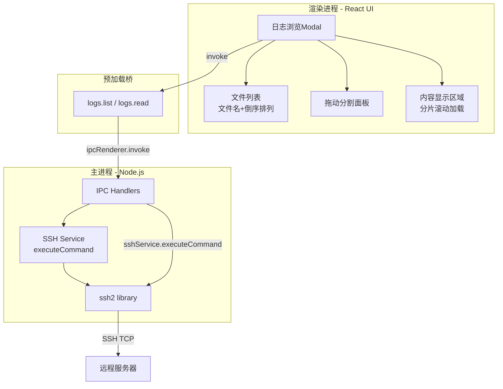

# 结果蓝图：日志浏览交互优化 + SSH超时修复

## PM Agent — 需求分析师模式：结果先行定义

### ① 需求分析Agent产出 — 前端终态

#### 页面完整列表
| 页面 | 用户角色 | 核心功能 | 入口路径 |
|------|---------|---------|---------|
| 服务器详情页（已有） | 管理员 | 浏览服务器实时/历史指标 | 服务器列表页（点击进入） |
| 日志浏览Modal（已有，需改造） | 管理员 | 浏览远程服务器日志文件 | 服务器详情页"浏览日志"按钮 |

#### 非功能需求
| 类别 | 需求描述 | 验收标准 |
|------|---------|---------|
| 性能 | 日志文件分片加载，每次只加载前64KB内容，后续按需加载 | 100MB日志文件首次加载≤2秒，滚动加载每片≤1秒 |
| SSH超时 | SSH命令执行超时从5秒延长至可配置，至少30秒 | 读取大文件不出现SSH_COMMAND_TIMEOUT错误 |
| 可用性 | 文件列表与内容区域支持鼠标拖动调整宽度 | 拖动分隔条时实时响应，最小宽度分别为200px/300px |
| 可用性 | 文件列表只显示文件名，不显示全路径 | 列表项无目录前缀，以文件名形式展示 |

#### 用户角色与权限
| 角色 | 可访问页面 | 可执行操作 |
|------|-----------|-----------|
| 管理员 | 服务器详情页、日志浏览Modal | 浏览日志列表、选择日志文件、滚动加载内容、拖动调整面板 |

---

### ② 架构设计Agent产出 — 系统架构终态

#### 架构图


**Mermaid源码**（使用 `flowchart` 替代 `graph`）：


#### 模块划分
| 模块 | 职责 | 技术选型 | 选型理由 |
|------|------|---------|---------|
| 日志浏览Modal | 展示文件列表、分片加载文件内容、分割面板交互 | React + Ant Design | 现有项目已有 Ant Design，无需新增依赖 |
| 拖动分割面板 | 实现左右面板宽度可调 | 原生 React 状态 + mouse事件 | 避免引入额外第三方库，逻辑简单 |
| 日志分片读取器 | 管理当前偏移量、触发后续分片加载 | React hooks (useState/useRef) | 与现有 React 架构一致 |
| SSH Service | 执行远程命令，支持分片读取（dd + base64） | ssh2 | 现有 SSH 服务，已有分片读取能力 |

#### 部署方案
| 环境 | 服务器 | 中间件 | 高可用方案 |
|------|--------|--------|-----------|
| 开发/生产 | 用户本机（Electron桌面应用） | 无 | 不适用（单机应用） |

#### 模块间交互关系
| 调用方 | 被调用方 | 通信方式 | 接口协议 |
|--------|---------|---------|---------|
| 日志浏览Modal | Preload logs.list | IPC invoke | { serverId } → string[] |
| 日志浏览Modal | Preload logs.read | IPC invoke | { serverId, filePath, offset, length } → string |
| IPC Handler | SSH Service | 直接调用 | executeCommand(serverId, command) |

---

### ③ 功能设计Agent产出 — 功能与交互终态

#### 每页的ASCII线框图与交互元素
**页面：日志浏览Modal**
```
+---------------------------------------------------+
| 日志列表                    [修改路径]      [关闭]   |
+---------------------------------------------------+
|         |                                          |
|  [文件列表]  |  文件内容显示区域                     |
|  ---------  |  ----------------------------------  |
|  app.log  |  | 2024-01-01 10:00:00 INFO ...      |  ← 可拖动
|  debug.log|  | 2024-01-01 10:00:01 INFO ...      |  分割条
|  error.log|  | ...                                |
|  sys.log  |  | [滚动加载中...]                      |
|  test.log |  |                                     |
|           |  |                                     |
+---------------------------------------------------+
```

**交互元素完整列表**：
| 元素 | 类型 | 位置 | 操作 | 反馈 |
|------|------|------|------|------|
| 文件列表项 | List.Item | 左侧面板 | 点击 | 高亮选中项，右侧加载文件内容 |
| 分割条 | 自定义分割线 | 左右面板中间 | 鼠标拖拽 | 实时调整两侧面板宽度 |
| 内容区域 | div (pre-wrap) | 右侧面板 | 滚动到底部 | 自动加载下一分片内容 |
| 修改路径按钮 | Button (link) | Modal 顶部 | 点击 | 弹出配置日志目录 Modal |

**页面间导航关系**：
```
服务器详情页 → 日志浏览Modal（点击"浏览日志"按钮）
日志浏览Modal → 配置日志目录Modal（点击"修改路径"按钮）
```

---

### ④ 技术设计Agent产出 — 技术实现终态

#### API完整定义
| 方法 | 路径 | 功能 | 请求参数 | 响应格式 | 错误码 |
|------|------|------|---------|---------|--------|
| invoke | log:list | 列出远程日志文件 | { serverId: string } | { success, data: string[] } | SERVER_NOT_FOUND, LOGS_PATH_NOT_CONFIGURED, SSH_NOT_CONNECTED, SSH_COMMAND_TIMEOUT |
| invoke | log:read | 读取日志文件（支持分片） | { serverId, filePath, offset?, length? } | { success, data: string } | 同上 + ACCESS_DENIED |

**注意**：log:read 已支持 offset/length 参数，无需新增 API。分片加载策略为：首次加载 offset=0, length=65536（64KB），后续每次加载 offset+=前一次length, length=65536。

#### 参数详情
**API：invoke log:read**
请求参数：
| 参数名 | 位置 | 类型 | 必填 | 说明 |
|--------|------|------|------|------|
| serverId | body | string | 是 | 服务器ID |
| filePath | body | string | 是 | 远程文件全路径 |
| offset | body | number | 否 | 读取起始偏移量（字节），默认0 |
| length | body | number | 否 | 读取字节数，不传则cat全量读取 |

#### 数据表完整设计
**无需新增数据表**。已有 `servers` 表包含 `logsPath` 字段。

#### 后端处理链路
**链路：分片读取日志**
```
[前端滚动到底部] → [invoke log:read] → [IPC Handler] → [SSH Service.executeCommand]
  ↓                       ↓                    ↓                    ↓
[计算offset+=length]  [传入offset/length]  [构造dd命令]    [dd if=X bs=1 skip=Y count=Z]
                                                                          ↓
[前端追加到display] ← [base64解码] ← [返回base64字符串] ← [SSH stream 'close']
```

---

### ⑤ 交叉维度完整性校验
| 校验方向 | 检查内容 | 结论 |
|---------|---------|------|
| 前端→后端 | 每个用户操作都有对应API | 通过：点击文件→log:read，滚动→log:read（同API不同参数） |
| 后端→数据 | 每条API都有对应数据操作 | 通过：log:list/log:read均通过SSH服务操作远程文件 |
| 数据→业务 | 所有操作基于已有数据表 | 通过：仅使用 servers.logsPath 字段 |
| 业务→全维度 | 分片加载逻辑在UI/API/数据中均体现 | 通过：前端维护offset→API传递offset/length→SSH执行dd命令 |

### ⑥ 完整性自检（15项）
| 序号 | 检查项 | 结果 |
|------|--------|------|
| 1 | 前端终态：所有页面已列出 | ✅ |
| 2 | 前端终态：所有交互元素已列出 | ✅ |
| 3 | 前端终态：所有表单字段已定义 | ✅（无新增表单） |
| 4 | 前端终态：导航关系已明确 | ✅ |
| 5 | 后端终态：所有API已列出 | ✅ |
| 6 | 后端终态：所有请求/响应已定义 | ✅ |
| 7 | 后端终态：处理链路已描述 | ✅ |
| 8 | 数据层终态：所有表已设计 | ✅（无新增表） |
| 9 | 数据层终态：所有字段已定义 | ✅（无新增字段） |
| 10 | 数据层终态：索引/外键已标注 | ✅（无新增） |
| 11 | 业务逻辑终态：所有业务规则已列出 | ✅ |
| 12 | 业务逻辑终态：状态流转已定义 | ✅ |
| 13 | 业务逻辑终态：权限已定义 | ✅ |
| 14 | 交叉维度校验已通过 | ✅ |
| 15 | 覆盖矩阵已产出 | ✅ |
| | **所有15项全部通过** | ✅ |

### ⑦ 覆盖矩阵
**前端→API覆盖矩阵**
| 页面操作 | 对应API | 方法 |
|---------|---------|------|
| 日志浏览Modal.打开 | log:list（获取文件列表） | invoke |
| 日志浏览Modal.点击文件 | log:read（首次读取offset=0） | invoke |
| 日志浏览Modal.滚动到底部 | log:read（offset递增） | invoke |
| 日志浏览Modal.修改路径 | server:update（保存新路径） | invoke |

**API→数据覆盖矩阵**
| API | 操作数据表 | 操作类型 |
|-----|-----------|---------|
| log:list | 无（远程文件系统） | Read（SSH find） |
| log:read | 无（远程文件系统） | Read（SSH dd/cat） |
| server:update | servers | Update（logsPath字段） |

**业务规则→全维度覆盖矩阵**
| 业务规则 | 前端体现 | API体现 | 数据体现 |
|---------|---------|---------|---------|
| 文件名仅显示basename | List.Item 展示 path.basename(item) | 无变化 | 无变化 |
| 文件列表按文件名倒序 | sort((a,b)=>b.localeCompare(a)) | 无变化 | 无变化 |
| 左右面板可拖拽调整 | mouse事件处理宽度 | 无变化 | 无变化 |
| 日志内容分片滚动加载 | 滚动事件 + offset状态管理 | log:read传入offset/length | 无变化 |
| SSH命令超时延长至30秒 | 无变化 | SSH_COMMAND_TIMEOUT=30000 | 无变化 |
