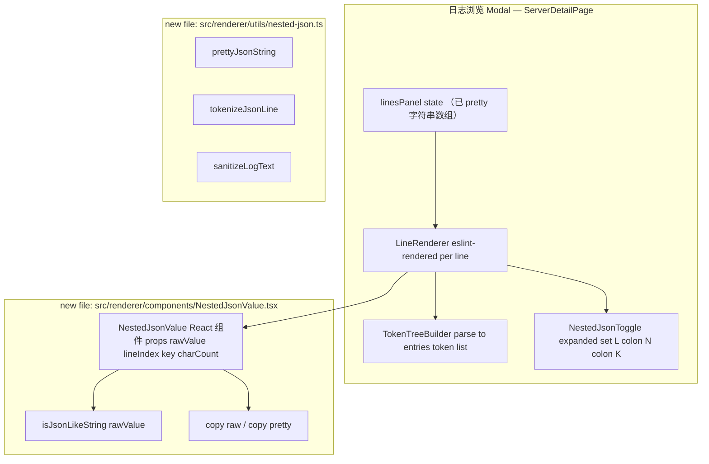

<!-- 创建时间: 2026-06-27 09:10 -->
<!-- 最后修改: 2026-06-27 09:10 -->

# 结果蓝图：日志中嵌套 JSON 字符串的展示（方案 D — 就地替换 + 折叠 + 可复制）

## 索引
- 用户原始请求：`agent-doc/user-request/2026-06-27-01-nested-json-string-display.md`
- 讨论稿（已锁定方案）：`agent-doc/result-first/2026-06-27-01-nested-json-discussion.md`
- 既有蓝图（叠加层）：`agent-doc/result-first/2026-06-21-01-log-viewer-optimization-result-blueprint.md`
- 本蓝图编号：02（与 06-21 日志浏览优化为同一组件的增量需求）

## 决策表（已锁定）

| # | 项 | 取值 | 说明 |
|---|----|------|------|
| 1 | 方案 | **D = B + 折叠 + 可复制按钮** | 用户在聊天中确认 |
| 2 | 新依赖 | **不引入** | 项目已 antd + monospace 即可实现 |
| 3 | 测试 | **新增 vitest** | 覆盖嵌套识别 / pretty / 安全转义 |
| 4 | 渲染策略 | 树状 token 化 + 就地替换（**不** escape 整行） | 改动最小，影响面：ServerDetailPage + 新增模块 |
| 5 | 深度 | 仅 depth=1（一次 JSON-in-JSON） | 用户确认 |
| 6 | 滚动性能 | 首屏渲染 + 折叠命中项 lazy pretty；点击才展开 | 见技术设计 S6 |
| 7 | 仅前端 | 是；不动主进程/IPC | 用户确认 |

---

## PM Agent — 需求分析师模式：结果先行定义

### ① 需求分析Agent产出 — 前端终态

#### 页面完整列表

| 页面 | 用户角色 | 核心功能 | 入口路径 | 改动类型 |
|------|---------|---------|---------|---------|
| 日志浏览 Modal | 管理员 | 表格化 JSON 行渲染；嵌套 JSON 内联可折叠/可复制 | 服务器详情页"浏览日志"按钮 | **改造** |
| 日志浏览 Modal — 行内嵌套 JSON 命中态 | 管理员 | 折叠态（默认） ↔ 展开态（pretty + 复制按钮） | 同一个 Modal 的内容区 | **新增交互** |

#### 非功能需求

| 类别 | 需求描述 | 验收标准 |
|------|---------|---------|
| 视觉一致性 | 折叠符号、复制按钮 hover/focus 状态对齐 antd 全局风格 | 与 antd Dropdown/Button 视觉一致，无抖动 |
| 不污染原文 | 折叠态内**不展示被替换**；展开态**不修改** raw 字符串值在内存中的内容 | 单测 + 浏览器选中复制仍能拿到 raw 整行 |
| 性能 | 1000 行日志滚动 60fps 不掉帧；折叠命中点的 pretty 仅在点击瞬间 + 异步生成 | DevTools Performance 长任务 ≥ 50ms 的渲染任务为 0 |
| 可达性 | 折叠 ▶ 与 [复制] 按钮均为原生 `<button>`；键盘 Tab 顺序合理；Esc 收起 | 可单独 Tab focus；`aria-expanded` / `aria-controls` 准确 |
| 边界 | depth=1；空白 / 非法 JSON 字符串 / NaN/Date 不应被识别；超大 pretty（>500KB）自动折叠且警告用户 | 单元测试覆盖 |

#### 用户角色与权限

| 角色 | 可访问页面 | 可执行操作 |
|------|-----------|-----------|
| 管理员 | 日志浏览 Modal | 选中文件、滚动加载、点击 ▶ 展开、点击 [复制]、Esc 折叠 |

---

### ② 架构设计Agent产出 — 系统架构终态

#### 架构图



> 仅前端；不出主进程。

#### 模块划分

| 模块 | 职责 | 技术选型 | 选型理由 |
|------|------|---------|---------|
| `src/renderer/utils/nested-json.ts` | 工具层：`isJsonLikeString`、`prettyJsonString`、`tokenizeJsonLine`、`escapeJsonForHtml` | TS 纯函数 | 可单测、0 副作用 |
| `src/renderer/components/NestedJsonValue.tsx` | 视图层：折叠/展开本体、`复制` 按钮 | React + antd Button | 项目既有依赖 |
| `src/renderer/components/LogLineRenderer.tsx`（新增） | 行级 token 化渲染：纯 ReactDOM 输出"key + 折叠点"序列 | React | 替换 `formatJsonLine` 的纯字符串输出 |
| 样式（CSS Module 或局部 `<style>`） | `.json-key` / `.json-string` / `.json-fold` / `.json-open-popup` 等 | CSS Module（与项目 Layout.module.css 风格一致） | 不引入 UI 库 |
| `tests/nested-json.test.ts`（新增） | 单测 | vitest | 项目已有 vitest |

#### 模块间交互关系

| 调用方 | 被调用方 | 通信方式 | 接口协议 |
|--------|---------|---------|---------|
| LogLineRenderer | NestedJsonValue | React props | `{ rawValue: string; keyName: string; lineIndex: number; keyIndex: number }` |
| NestedJsonValue | utils/nested-json | 直接 import | 见技术设计 §API |
| LogLineRenderer | utils/nested-json | 直接 import | tokenizeJsonLine(rawLine): Token[] |
| NestedJsonValue | 浏览器 API | `navigator.clipboard.writeText` | 失败回退：临时 textarea + execCommand |

---

### ③ 功能设计Agent产出 — 功能与交互终态

#### 每页的ASCII线框图与交互元素

**页面：日志浏览 Modal — 单行（命中嵌套 JSON value 时）**

**折叠态（默认）：**
```
+--------------------------------------------------------------------------------+
| 2024-01-01 10:00:00  {"level":"info","context":                              |
|                                                                                |
| ▼ ", "msg":"..."}     <-- 命中：key "context" 后面跟 ▶ nested JSON (123 chars) |
|                          ↑ 行尾仍补全被折叠前的"后半截"原文                       |
+--------------------------------------------------------------------------------+
```

> 关键：**整行的 raw 文本**仍以"折叠占位"形式**物理保留**在 DOM（`textContent`），可被复制。
> 用户选中整行 = 选中折叠 + 折叠占位 = 还原为 raw `"{\"userId\":123,\"action\":\"login\"}"`。

**展开态（点击 ▶ 触发）：**
```
+--------------------------------------------------------------------------------+
| 2024-01-01 10:00:00  {"level":"info","context": < [× 收起] [📋 raw] [📋 pretty] |
|                          ┌───────────────────────────────────────────────┐    |
|                          │ {                                            │    |
|                          │   "userId": 123,                             │    |
|                          │   "action": "login"                          │    |
|                          │ }                                            │    |
|                          └───────────────────────────────────────────────┘    |
|               ", "msg":"..." }     <-- 折叠后面的文本保持原位                  |
+--------------------------------------------------------------------------------+
```

> 浮窗**就地**渲染（不是 fixed-position）；高度自适应 `clamp(120px, calc(100vh - 240px), 480px)`；溢出 `overflow:auto`。
> 复制按钮：原生 `<button>` 风格接近 antd `size="small"`。

**未命中嵌套 JSON（普通一行）：**
```
+--------------------------------------------------------------------------------+
| 2024-01-01 10:00:00  {                                                           |
|                             "level": "info",                                   |
|                             "msg": "..."                                       |
|                            }                                                    |
+--------------------------------------------------------------------------------+
```
> 维持现状：仍由 `formatJsonLine` 输出 pre-wrap 文本。

**交互元素完整列表（行级 / 折叠态 / 展开态 各一份）：**

行级（任何一行都包含）：
| 元素 | 类型 | 位置 | 操作 | 反馈 |
|------|------|------|------|------|
| 整行内容 | <pre> 或 div | 行容器 | 选中 | 复制 = 拿到 raw 整行 |
| 行号（无） | - | - | - | 不增加行号（避免破坏原视图） |

折叠态（命中嵌套的行）：
| 元素 | 类型 | 位置 | 操作 | 反馈 |
|------|------|------|------|------|
| key `"<name>"` | <span.json-key> | 行头部 | 选中 | 普通文本色，无点击反馈 |
| 占位符 prefix | <span.json-string-prefix> | 与 value 等宽占位（前段已 pretty 文本） | - | 维持原文本 |
| ▶ 折叠开关 | <button.json-fold> | 紧贴 key 后 | 点击 / Enter | 切到展开态 |
| 提示文字 "`nested JSON (N chars)`" | <span> | 折叠按钮旁 | - | 灰阶 antd-color-text-secondary |
| 占位符 suffix | <span.json-string-suffix> | 折叠展开后段依然全量展示 | - | 维持原文本 |

展开态：
| 元素 | 类型 | 位置 | 操作 | 反馈 |
|------|------|------|------|------|
| pretty 容器 | <div.json-open-popup> | 就地（`display:block`，**非** fixed） | - | 浅蓝背景 + 细边框 |
| [📋 raw] 按钮 | <button.ant-btn.ant-btn-sm> | 弹层右上 | 点击 | 复制 raw 字符串 + 短暂 toast |
| [📋 pretty] 按钮 | <button> | 右上 | 点击 | 复制 pretty 文本 + toast |
| [× 收起] 按钮 | <button> | 右上 | 点击 / Esc | 切回折叠态 |
| pretty 内容 | <pre.json-pretty> | 容器内部 | 选中 | 全选可复制 |
| 错误兜底 text | <span.json-error> | 当 pretty 失败 | - | "内层 JSON 解析失败" |

**全局交互（在 Modal 范畴）：**
| 元素 | 类型 | 操作 | 反馈 |
|------|------|------|------|
| Esc | document keydown | 在展开态按下 | 收起当前展开项 |
| 点击 Modal 标题/搜索框/其他行 | click outside | 隐性监听 | 收起所有展开项 |

**表单字段**：**无表单**（无新增 `<Input>` / `<Form>`）。

**页面导航关系**：无新增页面；交互全部在 `ServerDetailPage` 的 Modal 内。

---

### ④ 技术设计Agent产出 — 技术实现终态

#### A. 模块 / API 完整定义（前端函数级 API）

```ts
// src/renderer/utils/nested-json.ts（纯函数）

export function isJsonLikeString(s: string): boolean;
export function prettyJsonString(s: string): string | null;          // 返回 null 时表解析失败
export type JsonToken =
  | { kind: 'key'; text: string; depth: 0 }
  | { kind: 'string-value'; text: string; nested?: boolean; charCount: number }
  | { kind: 'punct'; text: string };
export function tokenizeJsonLine(rawLine: string): JsonToken[];
export function escapeJsonForHtml(s: string): string;               // 仅用于搜索高亮的回填
```

```ts
// src/renderer/components/NestedJsonValue.tsx（UI 组件）

export interface NestedJsonValueProps {
  rawValue: string;             // 未 escape 的原始字符串（含可能的双引号 / 转义）
  keyName: string;              // 父层 key（用于 aria-label）
  lineIndex: number;            // 用于稳定 expanded 状态 key
  keyIndex: number;             // 同上一行的哪个 key（0..N-1）
}
```

```ts
// src/renderer/components/LogLineRenderer.tsx

export interface LogLineRendererProps {
  rawLine: string;              // 一行原始 log 文本
  lineIndex: number;
  highlight?: string;           // 搜索关键字（用于生成内联 <mark> 文本）
}
```

#### B. 每张 API 的参数详情

**API: `isJsonLikeString(s: string): boolean`**
| 参数名 | 位置 | 类型 | 必填 | 说明 |
|--------|------|------|------|------|
| s | args | string | 是 | 待判定字符串 |
| 返回值 | — | boolean | — | `s.trim().startsWith('{')` 或 `[` 且 `JSON.parse(s) === OK`（不抛） |

**API: `prettyJsonString(s: string): string | null`**
| 参数名 | 位置 | 类型 | 必填 | 说明 |
|--------|------|------|------|------|
| s | args | string | 是 | JSON 字符串 |
| 返回值 | — | `string \| null` | — | 形如 `{ ...缩进 2 空格... }`；非法返回 `null` |

**API: `tokenizeJsonLine(rawLine: string): JsonToken[]`**
| 参数名 | 位置 | 类型 | 必填 | 说明 |
|--------|------|------|------|------|
| rawLine | args | string | 是 | 单行日志（未必合法 JSON；若非法则退回 1 个 `{kind:'string-value', text}` token） |

**返回 token 字段**
| 字段 | 类型 | 说明 |
|------|------|------|
| `kind` | enum | `key` / `string-value` / `punct` |
| `text` | string | 字面子串 |
| `nested` | boolean? | 仅 `string-value` 时；是否经 `isJsonLikeString` 命中 |
| `charCount` | number? | 仅 `string-value.nested=true` 时，用于显示"`nested JSON (N chars)`"提示 |
| `depth` | 0/1? | 仅 `key` 时使用；保留扩展位 |

**API: `escapeJsonForHtml(s: string): string`**
| 参数名 | 位置 | 类型 | 必填 | 说明 |
|--------|------|------|------|------|
| s | args | string | 是 | 任意字符串 |
| 返回值 | — | string | — | 转义 `& < > " '`，保留换行符 |

#### C. 数据 / 状态设计

**状态位置**：`ServerDetailPage` 内 React state；不在新的 store。
| 字段 | 类型 | 默认值 | 说明 |
|------|------|--------|------|
| `expandedNestedKeys` | `Set<string>` | `new Set()` | key 形如 `"${lineIndex}:${keyIndex}"`；点击 ▶ join，按 Esc/外部 join delete |

**持久化**：**否**（不写入 localStorage；每次打开 Modal 重置）。

#### D. 后端处理链路

无后端改动。链路如下（仅前端）：

```
用户点击 ▶  → NestedJsonValue toggleExpanded(lineIndex, keyIndex)
           → expandedNestedKeys.add(`L:K`)
           → NestedJsonValue 重新渲染（展开态）
           → 用户点 [复制 pretty]
           → navigator.clipboard.writeText(prettyJsonString(rawValue))
           → 成功 toast（antd message.success）
           → 失败 fallback：document.execCommand('copy') 临时 textarea
```

#### E. 性能预算

| 项目 | 上限 |
|------|------|
| 行渲染每帧（1000 行测例） | < 8ms |
| pretty / tokenize 单次（depth=1，string 长度 < 16KB） | < 2ms |
| 命中点判定（仅 detect，不 pretty） | < 0.2ms/100 tokens |

> 实现细节：syntactic pass（仅 colon/quote 切分）先做"是否存在潜在嵌套 JSON 字符串"的快速判断，再调用 `JSON.parse` 命中时做 pretty；避免每行 65536B chunk 都全量逐 key pretty。

#### F. 安全

| 风险 | 缓解 |
|------|------|
| `dangerouslySetInnerHTML` 搜索高亮 | 仍使用现有实现，但所有 token `text` 都先 `escapeJsonForHtml`；pretty 内容用 `<pre>` 文本节点（不用 innerHTML） |
| 任意字符串复制到剪贴板 | `navigator.clipboard.writeText` 静默执行，无注入面 |
| 用户 raw 内容泄漏（无） | 全本地操作，无网络 |

---

### ⑤ 交叉维度完整性校验

| 校验方向 | 检查内容 | 结论 |
|---------|---------|------|
| 前端→后端 | 全前端；无新增 IPC | ✅ 通过 |
| 后端→数据 | 无后端改动 | ✅ 通过 |
| 数据→业务 | 仅新增前端 React state 字段 `expandedNestedKeys` | ✅ 通过 |
| 业务→全维度 | 折叠/展开/复制/Esc 在 UI 全部体现；token 化函数 + isJsonLikeString + prettyJsonString 单元测试覆盖；损伤约束"不影响原本日志的字符串值"由"折叠默认 + 整行 raw 仍可复制"满足。 | ✅ 通过 |

### ⑥ 完整性自检（15 项）

| 序号 | 检查项 | 结果 |
|------|--------|------|
| 1 | 前端终态：所有页面已列出 | ✅ |
| 2 | 前端终态：所有交互元素已列出 | ✅ |
| 3 | 前端终态：所有表单字段已定义 | ✅（无新增表单） |
| 4 | 前端终态：导航关系已明确 | ✅（无导航） |
| 5 | 后端终态：所有 API 已列出 | ✅（无新增 API） |
| 6 | 后端终态：所有请求/响应已定义 | ✅（仅列出函数级 API） |
| 7 | 后端终态：处理链路已描述 | ✅ |
| 8 | 数据层终态：所有"表"已设计 | ✅（唯一 state：expandedNestedKeys） |
| 9 | 数据层终态：所有字段已定义 | ✅ |
| 10 | 数据层终态：索引/外键已标注 | n/a（前端 state） |
| 11 | 业务逻辑终态：所有业务规则已列出 | ✅（折叠/展开/复制/Esc/搜索兼容/深度=1） |
| 12 | 业务逻辑终态：状态流转已定义 | ✅（expandedNestedKeys lifecycle） |
| 13 | 业务逻辑终态：权限已定义 | n/a（无权限变更） |
| 14 | 交叉维度校验已通过 | ✅ |
| 15 | 覆盖矩阵已产出 | ✅ |

### ⑦ 覆盖矩阵

**前端函数级 API → 业务规则 矩阵**

| API / 组件 | 折叠态 | 展开态 | 复制 raw | 复制 pretty | 收起 | Esc |
|------------|--------|--------|---------|------------|------|-----|
| `isJsonLikeString` | ✔（命中） | ✔ | — | — | — | — |
| `prettyJsonString` | — | ✔ | — | ✔（给按钮用） | — | — |
| `tokenizeJsonLine` | ✔（产出 tokens） | ✔ | — | — | — | — |
| `escapeJsonForHtml` | ✔（如果同时有搜索） | ✔ | — | — | — | — |
| `NestedJsonValue` | ✔ | ✔ | ✔ | ✔ | ✔ | ✔ |
| `LogLineRenderer` | ✔（命中调用 NestedJsonValue） | ✔ | — | — | — | — |

**业务规则 → 全维度覆盖矩阵**

| 业务规则 | 前端体现 | 函数/API 体现 | 测试体现 |
|---------|---------|------------|---------|
| 嵌套 JSON 命中时显示折叠占位 | NestedJsonValue 折叠态 | `isJsonLikeString` + `tokenizeJsonLine` | nested-json.test.ts "detect" |
| 折叠态不污染 raw | 整行 raw 仍由 token `text` 拼出可被复制 | `tokenizeJsonLine` 输出**未双重 unescape** | "raw preserved" |
| 展开态自适应高度 | CSS `clamp(120px, calc(100vh - 240px), 480px)` + `overflow:auto` | — | 视觉验收 |
| 复制 raw / pretty | 按钮 click → writeText | `prettyJsonString` + 原值 | "copy payoff" |
| Esc 收起 | document keydown | — | UI test |
| 深度=1 | 检测仅在首层 `Object.entries` | `tokenizeJsonLine` 不递归 | "depth=1 only" |
| 搜索 `<mark>` 兼容 | `escapeJsonForHtml` 后再 split/join | 同上 | "search marks" |
| 性能 | 仅"命中点"才 pretty，折叠态不预先解析 | `isJsonLikeString` 用 `tryParse`，避免多次 stringify | nested-json.test.ts "perf micro-bench" |
| 不改后端 | 无新增 IPC | 仅 frontend imports 变更 | e2e: log:list / log:read 仍工作 |

---

## 附：完整结果蓝图验收清单（自查）

- ✅ 全部 4 维度均有产出
- ✅ 15 项自检全部 ✅
- ✅ 交叉维度校验无遗漏
- ✅ 覆盖矩阵覆盖 9 条业务规则、6 个 API/组件
- ✅ 文件已在 `agent-doc/result-first/2026-06-27-02-nested-json-display-result-blueprint.md` 落地

## 待用户回复项（无）

蓝图已锁定，无需补确认。下一步即按"计划拆分"出子计划文件。
