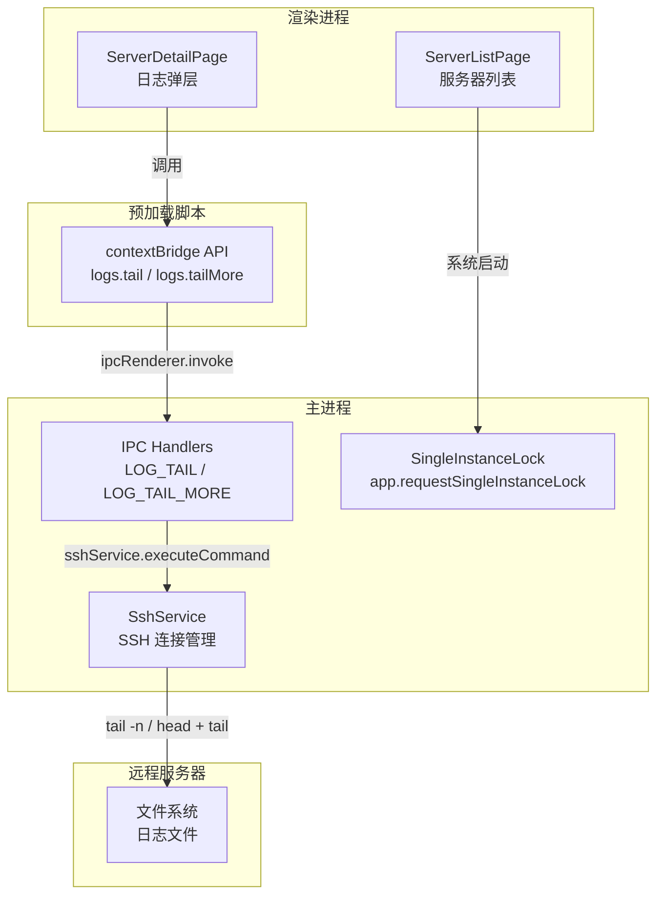

<!-- 创建时间: 2026-07-12 11:30 -->
<!-- 最后修改: 2026-07-12 11:30 -->

## PM Agent — 需求分析师模式：结果先行定义

### ① 需求分析Agent产出 — 前端终态

#### 页面完整列表
| 页面 | 用户角色 | 核心功能 | 入口路径 |
|------|---------|---------|---------|
| 服务器详情页（日志弹层） | 管理员 | 从末尾浏览日志文件，跳转到最新内容 | 服务器列表 → 详情页 → 浏览日志 |
| 服务器列表页 | 管理员 | 点击桌面快捷方式/EXE 仅启动一个实例 | 桌面快捷方式 |
| 系统托盘 | 管理员 | 双击/右键显示窗口 | 系统托盘图标 |

#### 非功能需求
| 类别 | 需求描述 | 验收标准 |
|------|---------|---------|
| 性能 | 日志打开时直接展示末尾内容，无需等待从头读取 | 打开 100MB 日志文件，首屏显示 < 2s |
| 安全 | `tail` 命令必须校验文件路径在 logsPath 下 | 路径穿越尝试被拒绝 |
| 可用性 | 打开日志文件自动定位到最新内容 | 用户无需手动滚动到底部 |

#### 用户角色与权限
| 角色 | 可访问页面 | 可执行操作 |
|------|-----------|-----------|
| 管理员 | 所有页面 | 浏览日志（从末尾开始）、启动/停止监控、添加/编辑/删除服务器 |
| 访客 | 无（未实现） | 无 |

---

### ② 架构设计Agent产出 — 系统架构终态

#### 架构图


**Mermaid源码**：


#### 模块划分
| 模块 | 职责 | 技术选型 | 选型理由 |
|------|------|---------|---------|
| 日志尾部浏览 | 从远程文件末尾读取 N 行，支持向上翻页加载更早内容 | SSH + `tail`/`head` 命令 | 无需复杂协议，SSH 已打通 |
| 单实例锁 | 防止 Electron 多开，后续实例聚焦已有窗口 | Electron `app.requestSingleInstanceLock` | 官方 API，零依赖 |
| IPC 通道 | 新增 `logs.tail` / `logs.tailMore` 通道 | Electron ipcMain/ipcRenderer | 与现有模式一致 |
| Preload API | 暴露 `logs.tail` / `logs.tailMore` 给渲染进程 | contextBridge | 安全隔离 |

#### 部署方案
| 环境 | 服务器 | 中间件 | 高可用方案 |
|------|--------|--------|-----------|
| 开发 | 本地开发机 | Electron 32 | 无 |
| 生产 | 用户桌面 | Electron 32 | 无（桌面应用） |

#### 模块间交互关系
| 调用方 | 被调用方 | 通信方式 | 接口协议 |
|--------|---------|---------|---------|
| ServerDetailPage | preload.logs.tail | IPC invoke | `(serverId, filePath, nLines) => string` |
| ServerDetailPage | preload.logs.tailMore | IPC invoke | `(serverId, filePath, beforeLine) => string` |
| app.whenReady | app.requestSingleInstanceLock | 直接调用 | 返回 boolean |
| 后续实例 | 已有实例窗口 | second-instance 事件 | focus/restore 已有窗口 |

---

### ③ 功能设计Agent产出 — 功能与交互终态

**页面：服务器详情页 - 日志弹层**
```
+----------------------------------------------------------+
| 日志列表                                          [⬜搜索] |
+----------------------------------------------------------+
| [文件列表]  |  [日志内容区域]                               |
|             |                                              |
|  app.log    |  2024-01-01 INFO Server started              |
|  error.log  |  2024-01-01 INFO Connection established      |
|  access.log |  2024-01-01 ERROR Timeout                    |
|             |  2024-01-01 INFO Retry...                    |
|             |  2024-01-01 INFO Success                     |
|             |  ...                                         |
|             |  [↓ 跳至最新] [↑ 加载更早]                    |
|             |                                              |
+----------------------------------------------------------+
```

**交互元素完整列表**：
| 元素 | 类型 | 位置 | 操作 | 反馈 |
|------|------|------|------|------|
| 文件列表 | 左侧面板 | 文件列表区域 | 点击选中文件 | 高亮选中项，右侧加载内容 |
| 日志内容区 | 滚动区域 | 右侧面板 | 滚动 | 向上滚动触发加载更早日志 |
| "跳至最新"按钮 | 浮动按钮 | 日志内容区右下角 | 点击 | 滚动到日志末尾 |
| "加载更早"触发 | 自动滚动触发 | 日志内容区顶部 | 滚动到顶部 | 加载更早 N 行追加到内容区顶部 |
| 搜索输入框 | 输入框 | 日志弹层头部 | 输入关键字 | 高亮匹配行 |
| 搜索上/下导航 | 按钮 | 搜索框旁 | 点击 | 跳到上一个/下一个匹配行 |

**表单字段完整定义**：无新增表单

**页面间导航关系**：
```
服务器列表页 → 服务器详情页（点击服务器卡片）
服务器详情页 → 日志弹层（点击"浏览日志"按钮）
日志弹层 → 日志文件末尾（自动定位，打开即显示末尾 N 行）
```

---

### ④ 技术设计Agent产出 — 技术实现终态

#### API完整定义
| 方法 | 路径 | 功能 | 请求参数 | 响应格式 | 错误码 |
|------|------|------|---------|---------|--------|
| invoke | logs:tail | 读取远程文件末尾 N 行 | `{ serverId, filePath, nLines }` | `IpcResponse<string>` | SERVER_NOT_FOUND / LOGS_PATH_NOT_CONFIGURED / ACCESS_DENIED |
| invoke | logs:tailMore | 读取指定行之前的更早 N 行 | `{ serverId, filePath, beforeLine, nLines }` | `IpcResponse<string>` | 同上 |

#### 每张API的参数详情
**API：invoke logs:tail**
请求参数：
| 参数名 | 位置 | 类型 | 必填 | 说明 |
|--------|------|------|------|------|
| serverId | body | string | 是 | 服务器 ID |
| filePath | body | string | 是 | 日志文件绝对路径 |
| nLines | body | number | 否 | 读取行数，默认 500 |

响应体：
```json
{ "success": true, "data": "line1\nline2\n...line500" }
```
错误响应：
```json
{ "success": false, "error": "SERVER_NOT_FOUND" }
```

**API：invoke logs:tailMore**
请求参数：
| 参数名 | 位置 | 类型 | 必填 | 说明 |
|--------|------|------|------|------|
| serverId | body | string | 是 | 服务器 ID |
| filePath | body | string | 是 | 日志文件绝对路径 |
| beforeLine | body | string | 是 | 基准行内容（读取该行之前的更早内容） |
| nLines | body | number | 否 | 读取行数，默认 500 |

响应体：
```json
{ "success": true, "data": "earlier-line1\n...\nearlier-line500" }
```

#### 数据表完整设计：无新增数据表

#### 后端处理链路
**链路：日志尾部读取**
```
[请求 logs:tail] → [IPC Handler] → [SSH 执行 tail -n 500 filePath]
  ↓                   ↓                  ↓
[校验参数]          [路径安全校验]    [返回 stdout]
```

**链路：加载更早日志**
```
[请求 logs:tailMore] → [IPC Handler] → [SSH: wc -l filePath → 计算跳过行数]
  ↓                       ↓                    ↓
[校验参数]              [路径安全校验]   [head -n $skip filePath | tail -n 500]
```

**链路：单实例锁**
```
[app 启动] → [app.requestSingleInstanceLock()]
  ↓               ↓
[获得锁] → continue 正常启动
[未获得锁] → app.quit() + 触发 second-instance 事件聚焦已有窗口
```

---

### ⑤ 交叉维度完整性校验

| 校验方向 | 检查内容 | 结论 |
|---------|---------|------|
| 前端→后端 | 用户"打开日志文件"操作是否有对应 API | 通过（logs:tail） |
| 前端→后端 | 用户"滚动到顶部加载更早"操作是否有对应 API | 通过（logs:tailMore） |
| 前端→后端 | 用户"点击桌面快捷方式"操作是否有对应逻辑 | 通过（singleInstanceLock） |
| 后端→数据 | 每条 API 是否都有对应数据操作 | 通过（SSH 文件读取） |
| 数据→业务 | 无新增数据表 | 通过 |
| 业务→全维度 | 单实例锁是否在 UI/API/数据中均体现 | 通过（仅在主进程层，不影响 UI/API/数据） |

### ⑥ 完整性自检（15项）
| 序号 | 检查项 | 结果 |
|------|--------|------|
| 1 | 前端终态：所有页面已列出 | ✅ |
| 2 | 前端终态：所有交互元素已列出 | ✅ |
| 3 | 前端终态：所有表单字段已定义 | ✅（无新增表单） |
| 4 | 前端终态：导航关系已明确 | ✅ |
| 5 | 后端终态：所有API已列出 | ✅ |
| 6 | 后端终态：所有请求/响应已定义 | ✅ |
| 7 | 后端终态：处理链路已描述 | ✅ |
| 8 | 数据层终态：所有表已设计 | ✅（无新增数据表） |
| 9 | 数据层终态：所有字段已定义 | ✅（无新增数据表） |
| 10 | 数据层终态：索引/外键已标注 | ✅（无新增数据表） |
| 11 | 业务逻辑终态：所有业务规则已列出 | ✅ |
| 12 | 业务逻辑终态：状态流转已定义 | ✅（无状态变更） |
| 13 | 业务逻辑终态：权限已定义 | ✅（无权限变更） |
| 14 | 交叉维度校验已通过 | ✅ |
| 15 | 覆盖矩阵已产出 | ✅ |
| | **所有15项全部通过** | **✅** |

### ⑦ 覆盖矩阵
**前端→API覆盖矩阵**
| 页面操作 | 对应API | 方法 |
|---------|---------|------|
| 日志弹层.打开文件 | logs:tail | invoke |
| 日志弹层.向上滚动加载更早 | logs:tailMore | invoke |
| 应用启动.多次点击桌面图标 | requestSingleInstanceLock | 主进程直接调用 |

**API→数据覆盖矩阵**
| API | 操作数据表 | 操作类型 |
|-----|-----------|---------|
| logs:tail | SSH 远程文件系统 | Read (tail) |
| logs:tailMore | SSH 远程文件系统 | Read (head+tail) |
| singleInstanceLock | 无 | 无 |

**业务规则→全维度覆盖矩阵**
| 业务规则 | 前端体现 | API体现 | 数据体现 |
|---------|---------|---------|---------|
| 日志从末尾开始展示 | ServerDetailPage 打开文件时调用 logs:tail | logs:tail 使用 tail -n 500 | 远程文件系统 |
| 向上滚动加载更早日志 | ServerDetailPage onScroll 检测到滚动到顶部时调用 logs:tailMore | logs:tailMore 使用 head+tail 获取目标行之前的内容 | 远程文件系统 |
| 防止应用多开 | 系统级，无前端体现 | app.requestSingleInstanceLock | 无 |

---

【结果蓝图已完成。请确认以上蓝图所有字段已完整填充、15项自检全部✅、交叉校验无遗漏？回复"确认"继续，或提出修改意见。】
