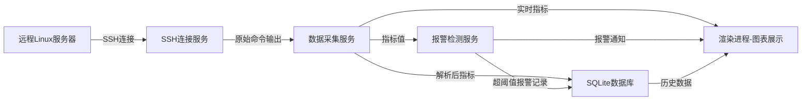
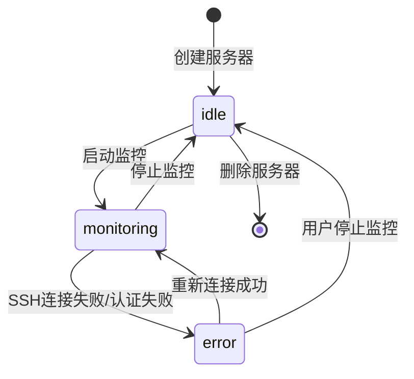

# Server Monitor - 应用终态描述

## 1. 项目概述

| 属性 | 值 |
|------|-----|
| 项目名称 | Server Monitor |
| 项目目标 | 一款本地Windows桌面应用，用于远程监控Linux服务器CPU/内存/磁盘/网络指标，支持阈值报警 |
| 技术栈 | React 18 + Vite + TypeScript + Electron + SQLite + Recharts + ssh2 + Ant Design |
| 用户角色 | 单用户（运维人员），无需登录系统 |
| 部署方式 | Windows桌面安装包（electron-builder打包为exe） |

---

## 2. 前端终态

### 2.1 服务器列表页（主页面）

**页面用途**：展示所有已配置的监控服务器卡片，是应用入口和核心操作页面

**页面线框图**：

```
┌─────────────────────────────────────────────────────────────────┐
│ [顶部标题栏: Server Monitor Logo / 应用名称 / 最小化/关闭]     │
├─────────────────────────────────────────────────────────────────┤
│ [工具栏: + 添加服务器 / 搜索框 / 全局状态统计]                 │
├─────────────────────────────────────────────────────────────────┤
│                                                                 │
│  ┌──────────────┐  ┌──────────────┐  ┌──────────────┐          │
│  │ 服务器卡片1  │  │ 服务器卡片2  │  │ 服务器卡片3  │          │
│  │ ┌──────────┐ │  │ ┌──────────┐ │  │ ┌──────────┐ │          │
│  │ │状态指示灯│ │  │ │状态指示灯│ │  │ │状态指示灯│ │          │
│  │ ├──────────┤ │  │ ├──────────┤ │  │ ├──────────┤ │          │
│  │ │IP/名称   │ │  │ │IP/名称   │ │  │ │IP/名称   │ │          │
│  │ │用户名    │ │  │ │用户名    │ │  │ │用户名    │ │          │
│  │ │监控周期  │ │  │ │监控周期  │ │  │ │监控周期  │ │          │
│  │ ├──────────┤ │  │ ├──────────┤ │  │ ├──────────┤ │          │
│  │ │CPU使用率 │ │  │ │CPU使用率 │ │  │ │CPU使用率 │ │          │
│  │ │内存使用率│ │  │ │内存使用率│ │  │ │内存使用率│ │          │
│  │ │磁盘使用率│ │  │ │磁盘使用率│ │  │ │磁盘使用率│ │          │
│  │ │网络流量  │ │  │ │网络流量  │ │  │ │网络流量  │ │          │
│  │ ├──────────┤ │  │ ├──────────┤ │  │ ├──────────┤ │          │
│  │ │迷你趋势图│ │  │ │迷你趋势图│ │  │ │迷你趋势图│ │          │
│  │ ├──────────┤ │  │ ├──────────┤ │  │ ├──────────┤ │          │
│  │ │[启动][停止]│ │  │ │[启动][停止]│ │  │ │[启动][停止]│ │          │
│  │ │[编辑][删除]│ │  │ │[编辑][删除]│ │  │ │[编辑][删除]│ │          │
│  └──────────────┘  └──────────────┘  └──────────────┘          │
│                                                                 │
│  ┌──────────────────────────────────────────────────────┐      │
│  │ [添加新服务器卡片: + 点击添加]                        │      │
│  └──────────────────────────────────────────────────────┘      │
│                                                                 │
├─────────────────────────────────────────────────────────────────┤
│ [底部状态栏: 已监控N台 / 报警N条 / 系统托盘图标]               │
└─────────────────────────────────────────────────────────────────┘
```

**页面布局说明**：
- 顶部：应用标题栏，含窗口控制按钮（最小化/关闭），点击关闭时最小化到系统托盘
- 工具栏：添加服务器按钮、搜索过滤框、全局统计（在线/离线/报警数）
- 主内容区：服务器卡片网格布局（响应式，每行2-3个卡片），每个卡片展示服务器基本信息、实时指标、迷你趋势图、操作按钮
- 底部：状态栏，显示监控概要和系统托盘入口

**交互元素**：

| 元素 | 类型 | 功能描述 | 触发行为 |
|------|------|---------|---------|
| + 添加服务器 | 按钮 | 打开添加服务器弹窗 | 弹出服务器配置表单弹窗 |
| 搜索框 | 输入框 | 按IP/名称过滤服务器卡片 | 实时过滤卡片列表 |
| 启动监控 | 按钮 | 开始对该服务器进行周期性监控 | 建立SSH连接，按周期采集数据 |
| 停止监控 | 按钮 | 停止对该服务器的监控 | 断开SSH连接，停止数据采集 |
| 编辑 | 按钮 | 修改服务器配置 | 弹出编辑表单弹窗（预填当前配置） |
| 删除 | 按钮 | 删除该服务器及历史数据 | 弹出确认对话框，确认后删除 |
| 卡片点击 | 点击 | 进入服务器详情页 | 跳转到服务器监控详情页 |

**表单详情（添加/编辑服务器弹窗）**：

| 字段名 | 类型 | 必填 | 校验规则 | 默认值 |
|--------|------|------|---------|--------|
| 服务器名称 | 文本输入 | 是 | 1-50字符 | - |
| IP地址 | 文本输入 | 是 | 合法IPv4格式 | - |
| SSH端口 | 数字输入 | 是 | 1-65535 | 22 |
| 用户名 | 文本输入 | 是 | 1-50字符 | - |
| 认证方式 | 下拉选择 | 是 | 密码/密钥 | 密码 |
| 密码 | 密码输入 | 条件必填 | 认证方式为密码时必填 | - |
| 私钥路径 | 文件选择 | 条件必填 | 认证方式为密钥时必填 | - |
| 监控周期 | 下拉选择 | 是 | 5s/10s/30s/60s/300s | 60s |
| 监控内容 | 多选框组 | 是 | 至少选一项 | CPU/内存/磁盘/网络全选 |
| CPU报警阈值 | 数字输入 | 否 | 0-100百分比 | 90 |
| 内存报警阈值 | 数字输入 | 否 | 0-100百分比 | 90 |
| 磁盘报警阈值 | 数字输入 | 否 | 0-100百分比 | 95 |
| 网络报警阈值 | 数字输入 | 否 | 正整数，单位Mbps | 100 |

**页面间导航**：
- 从本页面到服务器详情页：点击服务器卡片
- 从本页面到报警记录页：点击工具栏报警图标

---

### 2.2 服务器监控详情页

**页面用途**：展示单台服务器的详细监控数据和趋势图表

**页面线框图**：

```
┌─────────────────────────────────────────────────────────────────┐
│ [顶部标题栏: ← 返回 / 服务器名称(IP) / 状态指示灯 / 操作按钮] │
├─────────────────────────────────────────────────────────────────┤
│ [实时指标条: CPU xx% / 内存 xx% / 磁盘 xx% / 网络 xxMbps]      │
├─────────────────────────────────────────────────────────────────┤
│                                                                 │
│  ┌──────────────────────────────┐  ┌──────────────────────────┐│
│  │ [CPU使用率趋势图]            │  │ [内存使用率趋势图]      ││
│  │ ┌──────────────────────────┐ │  │ ┌──────────────────────┐ ││
│  │ │     Recharts折线图       │ │  │ │   Recharts折线图     │ ││
│  │ │     X轴:时间 Y轴:百分比  │ │  │ │   X轴:时间 Y轴:百分比│ ││
│  │ └──────────────────────────┘ │  │ └──────────────────────┘ ││
│  │ 当前: xx%  峰值: xx%         │  │ 当前: xx%  峰值: xx%     ││
│  │ [时间范围: 1h/6h/24h/7d]    │  │ [时间范围: 1h/6h/24h/7d]││
│  └──────────────────────────────┘  └──────────────────────────┘│
│                                                                 │
│  ┌──────────────────────────────┐  ┌──────────────────────────┐│
│  │ [磁盘使用率趋势图]          │  │ [网络流量趋势图]        ││
│  │ ┌──────────────────────────┐ │  │ ┌──────────────────────┐ ││
│  │ │     Recharts面积图       │ │  │ │   Recharts折线图     │ ││
│  │ │     X轴:时间 Y轴:百分比  │ │  │ │   X轴:时间 Y轴:Mbps  │ ││
│  │ └──────────────────────────┘ │  │ └──────────────────────┘ ││
│  │ 当前: xx%  峰值: xx%         │  │ 当前: ↑xx/↓xx Mbps     ││
│  │ [时间范围: 1h/6h/24h/7d]    │  │ [时间范围: 1h/6h/24h/7d]││
│  └──────────────────────────────┘  └──────────────────────────┘│
│                                                                 │
│  ┌──────────────────────────────────────────────────────────┐  │
│  │ [报警记录列表]                                           │  │
│  │ ┌──────┬──────────┬────────────┬────────┬──────────┐     │  │
│  │ │ 时间 │ 服务器   │ 报警类型   │ 指标值 │ 阈值     │     │  │
│  │ ├──────┼──────────┼────────────┼────────┼──────────┤     │  │
│  │ │ ...  │ ...      │ ...        │ ...    │ ...      │     │  │
│  │ └──────┴──────────┴────────────┴────────┴──────────┘     │  │
│  └──────────────────────────────────────────────────────────┘  │
│                                                                 │
├─────────────────────────────────────────────────────────────────┤
│ [底部状态栏: 上次采集时间 / 下次采集倒计时 / 监控状态]         │
└─────────────────────────────────────────────────────────────────┘
```

**页面布局说明**：
- 顶部：返回按钮、服务器标识、连接状态指示灯、启动/停止/编辑按钮
- 实时指标条：四个核心指标的当前值，超阈值时标红闪烁
- 主内容区：四个趋势图表（2x2网格），每个图表下方有时间范围切换
- 下方：报警记录表格，展示该服务器的历史报警
- 底部：采集状态信息

**交互元素**：

| 元素 | 类型 | 功能描述 | 触发行为 |
|------|------|---------|---------|
| ← 返回 | 按钮 | 返回服务器列表页 | 导航回列表页 |
| 时间范围切换 | 按钮组 | 切换图表展示的时间范围 | 1h/6h/24h/7d，切换后图表重新加载数据 |
| 启动/停止监控 | 按钮 | 启动或停止该服务器监控 | 建立或断开SSH连接 |
| 编辑配置 | 按钮 | 修改服务器配置 | 弹出编辑表单弹窗 |

---

### 2.3 报警记录页

**页面用途**：展示所有服务器的历史报警记录

**页面线框图**：

```
┌─────────────────────────────────────────────────────────────────┐
│ [顶部标题栏: ← 返回 / 报警记录 / 筛选条件]                     │
├─────────────────────────────────────────────────────────────────┤
│ [筛选栏: 服务器下拉 / 报警类型下拉 / 时间范围 / 清除筛选]       │
├─────────────────────────────────────────────────────────────────┤
│                                                                 │
│  ┌──────────────────────────────────────────────────────────┐  │
│  │ [报警记录表格]                                           │  │
│  │ ┌──────┬──────────┬────────────┬────────┬────────┬─────┐ │  │
│  │ │ 时间 │ 服务器IP │ 报警类型   │ 当前值 │ 阈值   │状态 │ │  │
│  │ ├──────┼──────────┼────────────┼────────┼────────┼─────┤ │  │
│  │ │ ...  │ ...      │ ...        │ ...    │ ...    │ ... │ │  │
│  │ └──────┴──────────┴────────────┴────────┴────────┴─────┘ │  │
│  │ [分页: < 1 2 3 ... >]                                    │  │
│  └──────────────────────────────────────────────────────────┘  │
│                                                                 │
├─────────────────────────────────────────────────────────────────┤
│ [底部状态栏: 总报警数 / 未处理报警数]                           │
└─────────────────────────────────────────────────────────────────┘
```

**页面布局说明**：
- 顶部：返回按钮、标题、筛选入口
- 筛选栏：按服务器、报警类型、时间范围过滤
- 主内容区：报警记录表格，支持分页
- 底部：报警统计

**交互元素**：

| 元素 | 类型 | 功能描述 | 触发行为 |
|------|------|---------|---------|
| 服务器筛选 | 下拉选择 | 按服务器过滤报警记录 | 筛选表格数据 |
| 报警类型筛选 | 下拉选择 | 按CPU/内存/磁盘/网络过滤 | 筛选表格数据 |
| 时间范围 | 日期范围选择 | 按时间范围过滤 | 筛选表格数据 |
| 清除筛选 | 按钮 | 重置所有筛选条件 | 恢复全部数据 |

**页面间导航**：
- 从服务器列表页工具栏报警图标 → 本页面
- 从服务器详情页报警记录区域"查看全部" → 本页面

---

### 2.4 应用内报警弹窗

**页面用途**：当监控指标超过阈值时，在应用内弹出报警通知

**线框图**：

```
┌──────────────────────────────────┐
│ ⚠ 报警通知                       │
├──────────────────────────────────┤
│ 服务器: 192.168.1.100            │
│ 报警类型: CPU使用率超过阈值       │
│ 当前值: 95%                      │
│ 阈值: 90%                        │
│ 时间: 2026-05-24 10:30:00        │
├──────────────────────────────────┤
│ [查看详情]  [忽略]               │
└──────────────────────────────────┘
```

**交互元素**：

| 元素 | 类型 | 功能描述 | 触发行为 |
|------|------|---------|---------|
| 查看详情 | 按钮 | 跳转到对应服务器详情页 | 导航到详情页 |
| 忽略 | 按钮 | 关闭当前报警弹窗 | 关闭弹窗，记录为已读 |

---

## 3. 后端终态

### 3.1 服务概览

| 服务名称 | 职责 | 对应前端操作 |
|----------|------|-------------|
| SSH连接服务 | 管理与远程服务器的SSH连接生命周期 | 启动/停止监控 |
| 数据采集服务 | 按配置周期通过SSH执行命令采集指标 | 实时指标展示 |
| 报警检测服务 | 检测指标是否超阈值，触发报警 | 报警弹窗 |
| 数据存储服务 | 管理SQLite数据库的读写 | 历史数据查询 |
| 服务器配置服务 | 管理服务器配置的CRUD | 添加/编辑/删除服务器 |
| 系统托盘服务 | 管理系统托盘图标和菜单 | 最小化到托盘/退出 |

### 3.2 API完整列表

Electron主进程通过IPC与渲染进程通信：

| IPC通道 | 方向 | 功能 | 请求参数 | 响应格式 |
|---------|------|------|---------|---------|
| `server:create` | 渲染→主 | 添加服务器配置 | `{name, ip, port, username, authType, password, privateKeyPath, monitorInterval, monitorItems, thresholds}` | `{id, success}` |
| `server:update` | 渲染→主 | 更新服务器配置 | `{id, ...updates}` | `{success}` |
| `server:delete` | 渲染→主 | 删除服务器 | `{id}` | `{success}` |
| `server:list` | 渲染→主 | 获取服务器列表 | `{}` | `[{id, name, ip, status, ...}]` |
| `server:getDetail` | 渲染→主 | 获取服务器详情 | `{id}` | `{id, name, ip, config, currentMetrics}` |
| `monitor:start` | 渲染→主 | 启动监控 | `{serverId}` | `{success}` |
| `monitor:stop` | 渲染→主 | 停止监控 | `{serverId}` | `{success}` |
| `monitor:getHistory` | 渲染→主 | 获取历史数据 | `{serverId, metricType, timeRange}` | `[{timestamp, value}]` |
| `alert:list` | 渲染→主 | 获取报警记录 | `{serverId?, alertType?, timeRange?, page, pageSize}` | `{total, list: [{...}]}` |
| `alert:dismiss` | 渲染→主 | 忽略报警 | `{alertId}` | `{success}` |
| `monitor:metrics` | 主→渲染 | 推送实时指标 | - | `{serverId, cpu, memory, disk, network}` |
| `alert:notification` | 主→渲染 | 推送报警通知 | - | `{serverId, alertType, currentValue, threshold, timestamp}` |

### 3.3 后端处理链路

**启动监控流程**：
```
用户点击"启动监控" → 渲染进程发送monitor:start IPC → 主进程接收
→ 加载服务器配置（IP/端口/凭据/周期/监控项）
→ 建立SSH连接（ssh2库）
→ 连接成功 → 创建定时采集任务（setInterval）
→ 连接失败 → 返回错误信息到渲染进程
```

**数据采集流程**：
```
定时器触发 → 通过SSH连接执行对应命令：
  CPU: cat /proc/stat 或 top -bn1
  内存: free -m
  磁盘: df -h
  网络: cat /proc/net/dev
→ 解析命令输出 → 提取指标数值
→ 存储到SQLite数据库
→ 检测是否超阈值 → 超阈值：触发报警流程
→ 通过IPC推送实时指标到渲染进程（monitor:metrics）
```

**报警触发流程**：
```
指标超阈值 → 创建报警记录（写入SQLite）
→ 通过IPC推送报警通知到渲染进程（alert:notification）
→ 渲染进程弹出报警弹窗
→ 用户点击"查看详情" → 跳转详情页
→ 用户点击"忽略" → 标记报警为已读
```

---

## 4. 数据层终态

### 4.1 数据库表设计

**servers表**：

| 字段名 | 类型 | 用途 | 索引 |
|--------|------|------|------|
| id | TEXT (UUID) | 主键 | PRIMARY |
| name | TEXT | 服务器名称 | - |
| ip | TEXT | 服务器IP地址 | - |
| port | INTEGER | SSH端口 | - |
| username | TEXT | SSH用户名 | - |
| auth_type | TEXT | 认证方式（password/key） | - |
| password_encrypted | TEXT | AES加密后的密码 | - |
| private_key_path | TEXT | 私钥文件路径 | - |
| monitor_interval | INTEGER | 监控周期（秒） | - |
| monitor_items | TEXT (JSON) | 监控内容列表 | - |
| cpu_threshold | REAL | CPU报警阈值 | - |
| memory_threshold | REAL | 内存报警阈值 | - |
| disk_threshold | REAL | 磁盘报警阈值 | - |
| network_threshold | REAL | 网络报警阈值 | - |
| status | TEXT | 监控状态（idle/monitoring/error） | - |
| created_at | TEXT (ISO8601) | 创建时间 | - |
| updated_at | TEXT (ISO8601) | 更新时间 | - |

**metrics表**：

| 字段名 | 类型 | 用途 | 索引 |
|--------|------|------|------|
| id | TEXT (UUID) | 主键 | PRIMARY |
| server_id | TEXT | 关联服务器ID | INDEX |
| metric_type | TEXT | 指标类型（cpu/memory/disk/network） | INDEX |
| value | REAL | 指标值 | - |
| details | TEXT (JSON) | 详细数据（如网络分上下行） | - |
| timestamp | TEXT (ISO8601) | 采集时间 | INDEX |

**alerts表**：

| 字段名 | 类型 | 用途 | 索引 |
|--------|------|------|------|
| id | TEXT (UUID) | 主键 | PRIMARY |
| server_id | TEXT | 关联服务器ID | INDEX |
| alert_type | TEXT | 报警类型（cpu/memory/disk/network） | INDEX |
| current_value | REAL | 触发时的指标值 | - |
| threshold | REAL | 设定的阈值 | - |
| status | TEXT | 状态（active/dismissed） | INDEX |
| created_at | TEXT (ISO8601) | 报警时间 | INDEX |

### 4.2 数据流向图



### 4.3 数据使用方式

| 功能模块 | 使用的数据 | 操作类型 | 频率 |
|----------|-----------|---------|------|
| 实时指标展示 | metrics最新记录 | Read | 每个监控周期 |
| 趋势图表 | metrics历史记录 | Read | 用户切换时间范围时 |
| 报警检测 | metrics最新值 + servers阈值 | Read | 每个监控周期 |
| 报警记录展示 | alerts记录 | Read | 用户查看时 |
| 服务器配置 | servers记录 | CRUD | 用户操作时 |
| 迷你趋势图 | metrics最近20条 | Read | 每个监控周期 |

---

## 5. 业务逻辑终态

### 5.1 核心业务对象生命周期

**服务器（Server）**：
- 创建条件：用户通过"添加服务器"表单提交配置
- 状态流转：



- 销毁条件：用户删除服务器时，级联删除关联metrics和alerts

**报警（Alert）**：
- 创建条件：采集指标超过对应阈值时自动创建
- 状态流转：active → dismissed（用户点击忽略）

### 5.2 业务规则

| 规则编号 | 规则描述 | 适用场景 | 约束 |
|----------|---------|---------|------|
| BR-1 | 同一指标在已有active报警时不重复创建 | 报警检测 | 避免同一指标持续超阈值时报警刷屏 |
| BR-2 | SSH密码必须AES加密存储 | 服务器配置存储 | 密钥由应用首次启动时生成，存储在用户目录 |
| BR-3 | 监控周期最小5秒 | 服务器配置 | 防止过频采集导致远程服务器负载过高 |
| BR-4 | 历史数据自动清理 | 数据存储 | 超过30天的metrics数据自动清理，避免数据库膨胀 |
| BR-5 | 应用关闭时断开所有SSH连接 | 应用退出 | 确保不留悬空连接 |
| BR-6 | 报警恢复后自动标记为dismissed | 报警检测 | 指标回落到阈值以下时自动恢复报警状态 |

### 5.3 管理维度

| 管理对象 | 可执行操作 | 操作者权限 | 操作边界 |
|----------|-----------|-----------|---------|
| 服务器 | 添加/编辑/删除/启动监控/停止监控 | 单用户无权限控制 | 不可删除正在监控中的服务器（需先停止） |
| 监控数据 | 查看/导出 | 单用户无权限控制 | 只读，不可手动修改采集数据 |
| 报警记录 | 查看/忽略/清除 | 单用户无权限控制 | 不可删除单条报警，可批量清除30天前记录 |
| 应用设置 | 窗口行为/数据保留天数/开机自启 | 单用户无权限控制 | 全局配置 |

---

## 6. 非功能性终态

| 属性 | 目标值 |
|------|--------|
| 应用启动时间 | < 3秒 |
| 内存占用（空闲） | < 100MB |
| 内存占用（监控10台服务器） | < 300MB |
| 安装包大小 | < 80MB |
| SSH连接超时 | 10秒 |
| 数据采集延迟 | < 2秒（从执行命令到前端展示） |
| 数据保留期 | 默认30天，可配置 |
| 同时监控服务器上限 | 20台 |
| 密码存储 | AES-256加密 |
| 系统要求 | Windows 10+ |
