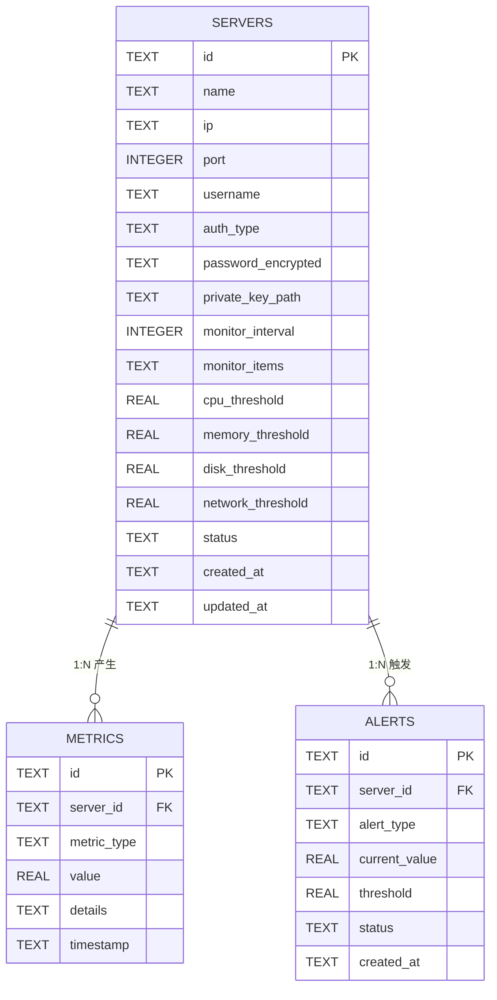
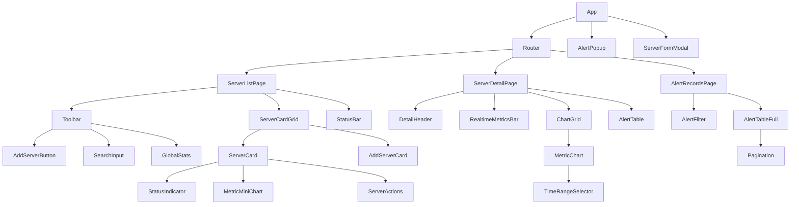
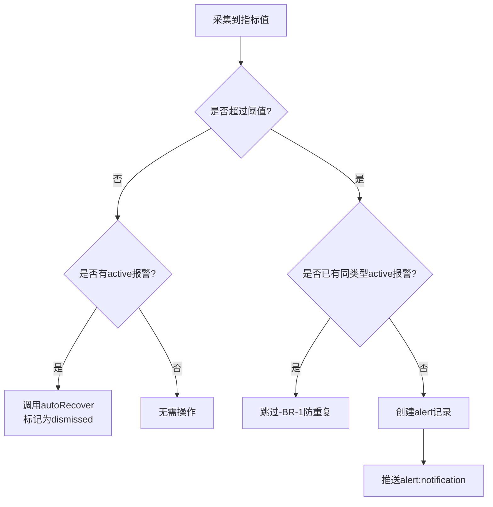

# Server Monitor - 技术设计文档

## 1. 数据模型

### 1.1 ER图



### 1.2 表结构定义

#### servers表

| 字段名 | SQLite类型 | 约束 | 说明 |
|--------|-----------|------|------|
| id | TEXT | PRIMARY KEY | UUID v4 |
| name | TEXT | NOT NULL | 服务器名称，1-50字符 |
| ip | TEXT | NOT NULL | IPv4地址 |
| port | INTEGER | NOT NULL DEFAULT 22 | SSH端口，1-65535 |
| username | TEXT | NOT NULL | SSH用户名 |
| auth_type | TEXT | NOT NULL DEFAULT 'password' | 认证方式：password / key |
| password_encrypted | TEXT | | AES-256-CBC加密后的Base64字符串 |
| private_key_path | TEXT | | 私钥文件绝对路径 |
| monitor_interval | INTEGER | NOT NULL DEFAULT 60 | 监控周期（秒），最小5 |
| monitor_items | TEXT | NOT NULL | JSON数组，如["cpu","memory","disk","network"] |
| cpu_threshold | REAL | DEFAULT 90 | CPU报警阈值百分比 |
| memory_threshold | REAL | DEFAULT 90 | 内存报警阈值百分比 |
| disk_threshold | REAL | DEFAULT 95 | 磁盘报警阈值百分比 |
| network_threshold | REAL | DEFAULT 100 | 网络报警阈值Mbps |
| status | TEXT | NOT NULL DEFAULT 'idle' | idle / monitoring / error |
| created_at | TEXT | NOT NULL | ISO8601格式 |
| updated_at | TEXT | NOT NULL | ISO8601格式 |

**索引**：

| 索引名 | 字段 | 类型 |
|--------|------|------|
| idx_servers_status | status | 普通索引 |

#### metrics表

| 字段名 | SQLite类型 | 约束 | 说明 |
|--------|-----------|------|------|
| id | TEXT | PRIMARY KEY | UUID v4 |
| server_id | TEXT | NOT NULL | 关联servers.id |
| metric_type | TEXT | NOT NULL | cpu / memory / disk / network |
| value | REAL | NOT NULL | 主指标值 |
| details | TEXT | | JSON对象，附加详细信息 |
| timestamp | TEXT | NOT NULL | ISO8601采集时间 |

**索引**：

| 索引名 | 字段 | 类型 |
|--------|------|------|
| idx_metrics_server_id | server_id | 普通索引 |
| idx_metrics_type | metric_type | 普通索引 |
| idx_metrics_timestamp | timestamp | 普通索引 |
| idx_metrics_server_type_time | server_id, metric_type, timestamp | 复合索引 |

#### alerts表

| 字段名 | SQLite类型 | 约束 | 说明 |
|--------|-----------|------|------|
| id | TEXT | PRIMARY KEY | UUID v4 |
| server_id | TEXT | NOT NULL | 关联servers.id |
| alert_type | TEXT | NOT NULL | cpu / memory / disk / network |
| current_value | REAL | NOT NULL | 触发时的指标值 |
| threshold | REAL | NOT NULL | 设定的阈值 |
| status | TEXT | NOT NULL DEFAULT 'active' | active / dismissed |
| created_at | TEXT | NOT NULL | ISO8601报警时间 |

**索引**：

| 索引名 | 字段 | 类型 |
|--------|------|------|
| idx_alerts_server_id | server_id | 普通索引 |
| idx_alerts_type | alert_type | 普通索引 |
| idx_alerts_status | status | 普通索引 |
| idx_alerts_created_at | created_at | 普通索引 |

> 对应终态：4.1 数据库表设计

### 1.3 数据迁移策略

使用better-sqlite3在应用启动时执行Schema初始化：

| 策略 | 说明 |
|------|------|
| 初始化时机 | Electron主进程app.on('ready')时 |
| 数据库文件位置 | `app.getPath('userData')/server-monitor.db` |
| Schema版本管理 | 在数据库中创建`schema_version`表记录版本号 |
| 迁移方式 | 每次启动检查版本号，按序执行增量迁移脚本 |
| 回滚策略 | 不支持降级回滚，迁移前备份数据库文件 |

```typescript
interface SchemaVersion {
  id: number
  version: number
  applied_at: string
}
```

> 对应终态：4.1 数据库表设计

---

## 2. 接口定义

### 2.1 IPC接口规范

#### 2.1.1 服务器配置接口

**server:create**

```typescript
interface ServerCreateRequest {
  name: string
  ip: string
  port: number
  username: string
  authType: 'password' | 'key'
  password?: string
  privateKeyPath?: string
  monitorInterval: number
  monitorItems: MonitorItem[]
  thresholds: {
    cpu?: number
    memory?: number
    disk?: number
    network?: number
  }
}

type MonitorItem = 'cpu' | 'memory' | 'disk' | 'network'

interface ServerCreateResponse {
  id: string
  success: boolean
  error?: string
}
```

> 对应终态：3.2 API完整列表 - server:create

**server:update**

```typescript
interface ServerUpdateRequest {
  id: string
  name?: string
  ip?: string
  port?: number
  username?: string
  authType?: 'password' | 'key'
  password?: string
  privateKeyPath?: string
  monitorInterval?: number
  monitorItems?: MonitorItem[]
  thresholds?: {
    cpu?: number
    memory?: number
    disk?: number
    network?: number
  }
}

interface ServerUpdateResponse {
  success: boolean
  error?: string
}
```

> 对应终态：3.2 API完整列表 - server:update

**server:delete**

```typescript
interface ServerDeleteRequest {
  id: string
}

interface ServerDeleteResponse {
  success: boolean
  error?: string
}
```

> 对应终态：3.2 API完整列表 - server:delete

**server:list**

```typescript
interface ServerListRequest {}

interface ServerListItem {
  id: string
  name: string
  ip: string
  port: number
  username: string
  monitorInterval: number
  monitorItems: MonitorItem[]
  status: 'idle' | 'monitoring' | 'error'
  currentMetrics?: {
    cpu?: number
    memory?: number
    disk?: number
    network?: { upload: number; download: number }
  }
}

type ServerListResponse = ServerListItem[]
```

> 对应终态：3.2 API完整列表 - server:list

**server:getDetail**

```typescript
interface ServerGetDetailRequest {
  id: string
}

interface ServerDetail {
  id: string
  name: string
  ip: string
  port: number
  username: string
  authType: 'password' | 'key'
  monitorInterval: number
  monitorItems: MonitorItem[]
  thresholds: {
    cpu: number
    memory: number
    disk: number
    network: number
  }
  status: 'idle' | 'monitoring' | 'error'
  currentMetrics?: {
    cpu: number
    memory: number
    disk: number
    network: { upload: number; download: number }
  }
  createdAt: string
  updatedAt: string
}
```

> 对应终态：3.2 API完整列表 - server:getDetail

#### 2.1.2 监控控制接口

**monitor:start**

```typescript
interface MonitorStartRequest {
  serverId: string
}

interface MonitorStartResponse {
  success: boolean
  error?: string
}
```

> 对应终态：3.2 API完整列表 - monitor:start

**monitor:stop**

```typescript
interface MonitorStopRequest {
  serverId: string
}

interface MonitorStopResponse {
  success: boolean
  error?: string
}
```

> 对应终态：3.2 API完整列表 - monitor:stop

**monitor:getHistory**

```typescript
interface MonitorGetHistoryRequest {
  serverId: string
  metricType: MonitorItem
  timeRange: '1h' | '6h' | '24h' | '7d'
}

interface MetricDataPoint {
  timestamp: string
  value: number
  details?: Record<string, unknown>
}

type MonitorGetHistoryResponse = MetricDataPoint[]
```

> 对应终态：3.2 API完整列表 - monitor:getHistory

#### 2.1.3 报警接口

**alert:list**

```typescript
interface AlertListRequest {
  serverId?: string
  alertType?: MonitorItem
  timeRange?: { start: string; end: string }
  page: number
  pageSize: number
}

interface AlertListItem {
  id: string
  serverId: string
  serverName: string
  serverIp: string
  alertType: MonitorItem
  currentValue: number
  threshold: number
  status: 'active' | 'dismissed'
  createdAt: string
}

interface AlertListResponse {
  total: number
  list: AlertListItem[]
}
```

> 对应终态：3.2 API完整列表 - alert:list

**alert:dismiss**

```typescript
interface AlertDismissRequest {
  alertId: string
}

interface AlertDismissResponse {
  success: boolean
  error?: string
}
```

> 对应终态：3.2 API完整列表 - alert:dismiss

#### 2.1.4 主进程推送接口

**monitor:metrics**（主→渲染推送）

```typescript
interface MonitorMetricsPush {
  serverId: string
  cpu?: { usage: number }
  memory?: { usedPercent: number; totalMb: number; usedMb: number }
  disk?: { usedPercent: number; totalGb: number; usedGb: number }
  network?: { uploadMbps: number; downloadMbps: number }
  timestamp: string
}
```

> 对应终态：3.2 API完整列表 - monitor:metrics

**alert:notification**（主→渲染推送）

```typescript
interface AlertNotificationPush {
  alertId: string
  serverId: string
  serverName: string
  alertType: MonitorItem
  currentValue: number
  threshold: number
  timestamp: string
}
```

> 对应终态：3.2 API完整列表 - alert:notification

### 2.2 接口与前端操作映射表

| IPC通道 | 前端触发操作 | 触发页面 | 期望响应行为 |
|---------|------------|---------|------------|
| server:create | 点击"添加服务器"提交表单 | 服务器列表页 | 刷新卡片列表，新卡片出现在列表中 |
| server:update | 点击"编辑"提交修改 | 服务器列表页 | 刷新对应卡片内容 |
| server:delete | 点击"删除"确认 | 服务器列表页 | 移除卡片，刷新列表 |
| server:list | 页面加载/数据变更时 | 服务器列表页 | 渲染卡片网格 |
| server:getDetail | 进入详情页 | 服务器详情页 | 渲染服务器配置和当前指标 |
| monitor:start | 点击"启动监控" | 列表页/详情页 | 卡片状态变为monitoring，开始接收实时数据 |
| monitor:stop | 点击"停止监控" | 列表页/详情页 | 卡片状态变为idle，停止数据推送 |
| monitor:getHistory | 切换时间范围 | 服务器详情页 | 图表重新渲染对应时间段数据 |
| alert:list | 进入报警页/筛选变更 | 报警记录页 | 渲染报警表格 |
| alert:dismiss | 点击"忽略" | 报警弹窗/报警页 | 标记为已读，移除active状态 |
| monitor:metrics | 被动接收 | 列表页/详情页 | 更新卡片实时指标和迷你图 |
| alert:notification | 被动接收 | 全局 | 弹出报警弹窗 |

### 2.3 错误码定义

| 错误码 | 含义 | 触发场景 | 用户提示 |
|--------|------|---------|---------|
| E_SSH_CONNECT | SSH连接失败 | 网络不通/端口错误 | "无法连接到服务器，请检查IP和端口" |
| E_SSH_AUTH | SSH认证失败 | 密码错误/密钥无效 | "认证失败，请检查用户名和密码" |
| E_SSH_TIMEOUT | SSH连接超时 | 网络延迟过高 | "连接超时，请检查网络或增大超时时间" |
| E_SSH_EXEC | 命令执行失败 | 权限不足/命令不存在 | "命令执行失败，请检查服务器权限" |
| E_SERVER_EXISTS | 服务器已存在 | 相同IP+端口已配置 | "该服务器已添加" |
| E_SERVER_MONITORING | 服务器正在监控中 | 删除/编辑正在监控的服务器 | "请先停止监控再操作" |
| E_INVALID_CONFIG | 配置校验失败 | 端口越界/周期过小 | 具体字段校验提示 |
| E_DB_ERROR | 数据库操作失败 | SQLite读写异常 | "数据操作失败，请重试" |
| E_ENCRYPT | 加密失败 | 密钥文件损坏 | "密码加密失败，请检查应用数据目录" |

> 对应终态：3.2 API完整列表

---

## 3. 组件设计

### 3.1 前端组件树



> 对应终态：2.1-2.4 前端终态

### 3.2 主进程服务组件

#### 3.2.1 SSH连接服务（SshService）

```typescript
class SshService {
  private connections: Map<string, Client>

  async connect(serverId: string, config: SshConfig): Promise<void>
  async disconnect(serverId: string): Promise<void>
  async execute(serverId: string, command: string): Promise<string>
  async testConnection(config: SshConfig): Promise<boolean>
  disconnectAll(): Promise<void>
  isConnected(serverId: string): boolean
}

interface SshConfig {
  host: string
  port: number
  username: string
  password?: string
  privateKey?: string
  connectTimeout: number
}
```

| 方法 | 职责 | 异常处理 |
|------|------|---------|
| connect | 建立SSH连接，存入connections Map | 连接失败抛出E_SSH_CONNECT，认证失败抛出E_SSH_AUTH |
| disconnect | 关闭指定SSH连接，从Map中移除 | 连接不存在时静默处理 |
| execute | 在指定SSH连接上执行命令并返回stdout | 连接断开时尝试重连一次，失败抛出E_SSH_EXEC |
| testConnection | 测试SSH连通性，不持久化连接 | 返回boolean，不抛异常 |
| disconnectAll | 关闭所有SSH连接 | app.on('before-quit')时调用 |

> 对应终态：3.1 服务概览 - SSH连接服务

#### 3.2.2 数据采集服务（CollectorService）

```typescript
class CollectorService {
  private timers: Map<string, NodeJS.Timeout>
  private sshService: SshService
  private alertService: AlertService
  private dbService: DatabaseService

  startCollecting(serverId: string, config: CollectConfig): void
  stopCollecting(serverId: string): void
  stopAll(): void
  private collectCpu(serverId: string): Promise<MetricResult>
  private collectMemory(serverId: string): Promise<MetricResult>
  private collectDisk(serverId: string): Promise<MetricResult>
  private collectNetwork(serverId: string): Promise<MetricResult>
  private parseCpu(output: string): number
  private parseMemory(output: string): { usedPercent: number; totalMb: number; usedMb: number }
  private parseDisk(output: string): { usedPercent: number; totalGb: number; usedGb: number }
  private parseNetwork(output: string, prevStats: NetworkStats): { uploadMbps: number; downloadMbps: number }
}

interface CollectConfig {
  interval: number
  items: MonitorItem[]
  thresholds: Thresholds
}

interface MetricResult {
  serverId: string
  type: MonitorItem
  value: number
  details?: Record<string, unknown>
  timestamp: string
}
```

| 方法 | 职责 | 异常处理 |
|------|------|---------|
| startCollecting | 创建setInterval定时器，按周期调用采集方法 | 采集失败时记录错误日志，不中断定时器 |
| stopCollecting | 清除定时器，从Map中移除 | 定时器不存在时静默处理 |
| collectCpu/Memory/Disk/Network | 通过SshService.execute执行对应命令 | SSH执行失败时更新服务器状态为error |
| parseCpu/Memory/Disk/Network | 解析命令输出提取指标 | 解析失败返回null，跳过本次采集 |

> 对应终态：3.1 服务概览 - 数据采集服务

#### 3.2.3 报警检测服务（AlertService）

```typescript
class AlertService {
  private dbService: DatabaseService
  private activeAlerts: Map<string, Set<string>>

  async checkAndAlert(serverId: string, metricType: MonitorItem, value: number, threshold: number): Promise<void>
  async dismissAlert(alertId: string): Promise<void>
  async autoRecover(serverId: string, metricType: MonitorItem): Promise<void>
  async listAlerts(filter: AlertFilter): Promise<AlertListResponse>
}

interface AlertFilter {
  serverId?: string
  alertType?: MonitorItem
  timeRange?: { start: string; end: string }
  page: number
  pageSize: number
}
```

| 方法 | 职责 | 异常处理 |
|------|------|---------|
| checkAndAlert | 检测指标是否超阈值，超阈值时创建报警并推送 | BR-1：同一server+type已有active报警时跳过 |
| dismissAlert | 标记报警为dismissed | 报警不存在时静默处理 |
| autoRecover | 指标回落到阈值以下时自动标记dismissed | BR-6：报警恢复自动消除 |
| listAlerts | 分页查询报警记录 | 无异常 |

> 对应终态：3.1 服务概览 - 报警检测服务

#### 3.2.4 数据存储服务（DatabaseService）

```typescript
class DatabaseService {
  private db: Database

  initialize(): void
  close(): void

  createServer(data: ServerCreateRequest): Server
  updateServer(id: string, data: ServerUpdateRequest): boolean
  deleteServer(id: string): boolean
  listServers(): ServerListItem[]
  getServerDetail(id: string): ServerDetail | null

  insertMetric(data: MetricInsertData): void
  getMetrics(serverId: string, type: MonitorItem, timeRange: string): MetricDataPoint[]
  getLatestMetrics(serverId: string, limit: number): MetricDataPoint[]
  cleanupOldMetrics(retentionDays: number): number

  createAlert(data: AlertInsertData): Alert
  dismissAlert(id: string): boolean
  hasActiveAlert(serverId: string, alertType: MonitorItem): boolean
  listAlerts(filter: AlertFilter): AlertListResponse
  cleanupOldAlerts(retentionDays: number): number
}
```

| 方法 | 职责 | 异常处理 |
|------|------|---------|
| initialize | 创建数据库连接，执行Schema迁移 | 文件损坏时备份并重建 |
| close | 关闭数据库连接 | app.on('before-quit')时调用 |
| cleanupOldMetrics | 删除超过retentionDays的metrics记录 | BR-4：30天自动清理 |
| cleanupOldAlerts | 删除超过retentionDays的已dismissed报警 | 管理维度：批量清除30天前记录 |

> 对应终态：3.1 服务概览 - 数据存储服务

#### 3.2.5 服务器配置服务（ServerConfigService）

```typescript
class ServerConfigService {
  private dbService: DatabaseService
  private collectorService: CollectorService
  private cryptoUtil: CryptoUtil

  async createServer(req: ServerCreateRequest): Promise<ServerCreateResponse>
  async updateServer(req: ServerUpdateRequest): Promise<ServerUpdateResponse>
  async deleteServer(req: ServerDeleteRequest): Promise<ServerDeleteResponse>
  listServers(): ServerListResponse
  getServerDetail(req: ServerGetDetailRequest): ServerDetail

  private encryptPassword(password: string): string
  private decryptPassword(encrypted: string): string
}
```

| 方法 | 职责 | 异常处理 |
|------|------|---------|
| createServer | 校验配置、加密密码、写入数据库 | 相同IP+端口已存在时抛出E_SERVER_EXISTS |
| updateServer | 校验配置、更新数据库 | 正在监控中不允许修改IP/端口/认证信息 |
| deleteServer | 校验状态、级联删除metrics和alerts | 正在监控中抛出E_SERVER_MONITORING |
| encryptPassword | AES-256-CBC加密 | BR-2：密码必须加密存储 |

> 对应终态：3.1 服务概览 - 服务器配置服务

#### 3.2.6 系统托盘服务（TrayService）

```typescript
class TrayService {
  private tray: Tray

  initialize(): void
  destroy(): void
  updateAlertBadge(count: number): void
}
```

| 方法 | 职责 | 异常处理 |
|------|------|---------|
| initialize | 创建托盘图标、右键菜单（显示窗口/退出） | 图标文件不存在时使用默认图标 |
| updateAlertBadge | 在托盘图标上显示未处理报警数 | 无异常 |

> 对应终态：3.1 服务概览 - 系统托盘服务

### 3.3 主进程与渲染进程职责划分

| 层 | 职责 | 不负责 |
|-----|------|--------|
| 主进程 | SSH连接管理、数据采集、报警检测、数据库操作、加密解密、系统托盘、窗口管理 | UI渲染、用户交互逻辑 |
| 渲染进程 | 页面渲染、用户交互、图表展示、表单校验、路由管理、状态管理 | SSH连接、文件系统访问、数据库操作 |
| 共享层(src/shared) | IPC通道名常量、TypeScript类型定义、错误码枚举 | 任何运行时逻辑 |

> 对应终态：3.1 服务概览

---

## 4. 集成方案

### 4.1 SSH数据采集详细设计

#### 4.1.1 采集命令与解析逻辑

**CPU使用率**

| 项 | 说明 |
|----|------|
| 执行命令 | `cat /proc/stat` |
| 采集频率 | 每个监控周期采集2次，间隔1秒 |
| 计算方式 | 两次采样间CPU时间差值计算使用率 |
| 解析逻辑 | 读取第一行`cpu`行，解析为：user, nice, system, idle, iowait, irq, softirq, steal |
| 计算公式 | `usage = 1 - (idle2 - idle1) / (total2 - total1)` |

```typescript
function parseCpuStatLine(line: string): CpuTimes {
  const parts = line.trim().split(/\s+/)
  return {
    user: Number(parts[1]),
    nice: Number(parts[2]),
    system: Number(parts[3]),
    idle: Number(parts[4]),
    iowait: Number(parts[5]),
    irq: Number(parts[6]),
    softirq: Number(parts[7]),
    steal: Number(parts[8]),
  }
}

function calculateCpuUsage(t1: CpuTimes, t2: CpuTimes): number {
  const idle1 = t1.idle + t1.iowait
  const idle2 = t2.idle + t2.iowait
  const total1 = Object.values(t1).reduce((a, b) => a + b, 0)
  const total2 = Object.values(t2).reduce((a, b) => a + b, 0)
  const usage = 1 - (idle2 - idle1) / (total2 - total1)
  return Math.round(usage * 10000) / 100
}
```

> 对应终态：3.3 后端处理链路 - 数据采集流程

**内存使用率**

| 项 | 说明 |
|----|------|
| 执行命令 | `free -m` |
| 采集频率 | 每个监控周期1次 |
| 解析逻辑 | 读取`Mem:`行，提取total、used、available |
| 计算方式 | `usedPercent = (1 - available / total) * 100` |

```typescript
function parseFreeOutput(output: string): MemoryInfo {
  const lines = output.trim().split('\n')
  const memLine = lines.find(l => l.startsWith('Mem:'))
  if (!memLine) throw new Error('Invalid free output')
  const parts = memLine.trim().split(/\s+/)
  const total = Number(parts[1])
  const available = Number(parts[6])
  const usedPercent = Math.round((1 - available / total) * 10000) / 100
  return { usedPercent, totalMb: total, usedMb: total - available }
}
```

> 对应终态：3.3 后端处理链路 - 数据采集流程

**磁盘使用率**

| 项 | 说明 |
|----|------|
| 执行命令 | `df -h /` |
| 采集频率 | 每个监控周期1次 |
| 解析逻辑 | 读取第二行（数据行），提取Size、Used、Avail、Use% |
| 计算方式 | 直接使用Use%列的数值 |

```typescript
function parseDfOutput(output: string): DiskInfo {
  const lines = output.trim().split('\n')
  if (lines.length < 2) throw new Error('Invalid df output')
  const parts = lines[1].trim().split(/\s+/)
  const usedPercent = Number(parts[4].replace('%', ''))
  const totalGb = Number(parts[1].replace('G', ''))
  const usedGb = Number(parts[2].replace('G', ''))
  return { usedPercent, totalGb, usedGb }
}
```

> 对应终态：3.3 后端处理链路 - 数据采集流程

**网络流量**

| 项 | 说明 |
|----|------|
| 执行命令 | `cat /proc/net/dev` |
| 采集频率 | 每个监控周期采集2次，间隔1秒 |
| 解析逻辑 | 过滤物理网卡（排除lo），累计所有网卡接收/发送字节数 |
| 计算方式 | 两次采样间字节数差值除以时间间隔，转换为Mbps |

```typescript
function parseNetDevOutput(output: string): NetworkBytes {
  const lines = output.trim().split('\n')
  let totalReceive = 0
  let totalTransmit = 0
  for (const line of lines.slice(2)) {
    if (line.includes('lo:')) continue
    const parts = line.trim().split(/[:\s]+/)
    if (parts.length < 11) continue
    totalReceive += Number(parts[1])
    totalTransmit += Number(parts[9])
  }
  return { receiveBytes: totalReceive, transmitBytes: totalTransmit }
}

function calculateNetworkRate(
  prev: NetworkBytes,
  curr: NetworkBytes,
  intervalSec: number
): NetworkRate {
  const downloadBps = (curr.receiveBytes - prev.receiveBytes) / intervalSec
  const uploadBps = (curr.transmitBytes - prev.transmitBytes) / intervalSec
  return {
    downloadMbps: Math.round((downloadBps * 8) / 1000000 * 100) / 100,
    uploadMbps: Math.round((uploadBps * 8) / 1000000 * 100) / 100,
  }
}
```

> 对应终态：3.3 后端处理链路 - 数据采集流程

### 4.2 报警检测算法设计

#### 4.2.1 阈值检测流程



#### 4.2.2 防重复逻辑

active报警去重Key：`${serverId}:${alertType}`

| 场景 | 行为 |
|------|------|
| CPU超阈值，无active报警 | 创建新报警，推送通知 |
| CPU超阈值，已有active CPU报警 | 跳过（BR-1） |
| CPU回落到阈值以下，有active CPU报警 | 自动标记dismissed（BR-6） |
| CPU回落到阈值以下，无active报警 | 无操作 |

> 对应终态：5.2 业务规则 BR-1、BR-6

### 4.3 数据清理定时任务设计

| 项 | 说明 |
|----|------|
| 执行方式 | 主进程setInterval，每小时执行1次 |
| 清理目标 | metrics表中timestamp超过retentionDays的记录 |
| 清理目标2 | alerts表中status=dismissed且created_at超过retentionDays的记录 |
| 默认保留天数 | 30天 |
| 可配置 | 应用设置中可修改retentionDays |
| 执行时间 | 单次删除批量1000条，循环执行直到清理完毕，避免阻塞主进程 |

```typescript
class CleanupTask {
  private timer: NodeJS.Timeout | null = null
  private retentionDays: number = 30

  start(): void {
    this.timer = setInterval(() => this.run(), 60 * 60 * 1000)
  }

  stop(): void {
    if (this.timer) {
      clearInterval(this.timer)
      this.timer = null
    }
  }

  private async run(): Promise<void> {
    const cutoff = new Date(Date.now() - this.retentionDays * 86400000).toISOString()
    let deleted = 0
    do {
      deleted = this.dbService.cleanupOldMetrics(this.retentionDays)
      await new Promise(r => setTimeout(r, 100))
    } while (deleted > 0)
    do {
      deleted = this.dbService.cleanupOldAlerts(this.retentionDays)
      await new Promise(r => setTimeout(r, 100))
    } while (deleted > 0)
  }
}
```

> 对应终态：5.2 业务规则 BR-4

---

## 5. 验收标准

### 5.1 服务器配置管理

| 编号 | Given | When | Then |
|------|-------|------|------|
| AC-1 | 应用已启动 | 用户填写完整服务器信息并点击添加 | 服务器卡片出现在列表中，状态为idle |
| AC-2 | 服务器已添加 | 用户点击编辑并修改名称 | 卡片显示更新后的名称 |
| AC-3 | 服务器状态为idle | 用户点击删除并确认 | 卡片从列表中移除 |
| AC-4 | 服务器状态为monitoring | 用户点击删除 | 提示"请先停止监控再操作" |
| AC-5 | 用户填写IP为非法格式 | 用户点击添加 | 表单校验失败，提示IP格式错误 |

> 对应终态：2.1 服务器列表页 - 表单详情

### 5.2 监控功能

| 编号 | Given | When | Then |
|------|-------|------|------|
| AC-6 | 服务器已添加，状态为idle | 用户点击启动监控 | 卡片状态变为monitoring，开始显示实时指标 |
| AC-7 | 服务器正在监控 | 采集周期到达 | 卡片上CPU/内存/磁盘/网络数值更新 |
| AC-8 | 服务器正在监控 | 用户点击停止监控 | 卡片状态变为idle，停止数据更新 |
| AC-9 | 服务器SSH连接失败 | 自动重连 | 状态变为error，显示错误信息 |
| AC-10 | 服务器正在监控 | 用户进入详情页 | 显示4个趋势图表，数据随采集实时更新 |
| AC-11 | 详情页图表已展示 | 用户切换时间范围为7d | 图表加载并展示7天内历史数据 |

> 对应终态：2.2 服务器监控详情页、3.3 数据采集流程

### 5.3 报警功能

| 编号 | Given | When | Then |
|------|-------|------|------|
| AC-12 | 服务器CPU阈值设为90%，当前CPU=95% | 采集周期到达 | 弹出报警通知弹窗 |
| AC-13 | 已有active CPU报警，CPU仍超阈值 | 下个采集周期 | 不重复弹出报警（BR-1） |
| AC-14 | 有active CPU报警，CPU回落到80% | 下个采集周期 | 报警自动标记为dismissed（BR-6） |
| AC-15 | 弹出报警弹窗 | 用户点击"查看详情" | 跳转到对应服务器详情页 |
| AC-16 | 弹出报警弹窗 | 用户点击"忽略" | 弹窗关闭，报警标记为dismissed |

> 对应终态：2.4 应用内报警弹窗、5.2 业务规则

### 5.4 数据管理

| 编号 | Given | When | Then |
|------|-------|------|------|
| AC-17 | metrics数据存在超过30天的记录 | 清理任务定时触发 | 自动删除超期记录（BR-4） |
| AC-18 | 用户添加服务器并输入密码 | 保存配置 | 密码以AES加密形式存储，数据库中不可见明文（BR-2） |
| AC-19 | 应用正在监控多台服务器 | 用户关闭应用窗口 | 所有SSH连接断开，应用最小化到托盘 |
| AC-20 | 应用最小化到托盘 | 用户右键托盘选择退出 | 所有SSH连接断开，应用退出（BR-5） |

> 对应终态：5.2 业务规则 BR-2/BR-4/BR-5

### 5.5 非功能性验收

| 编号 | Given | When | Then |
|------|-------|------|------|
| AC-21 | 应用已启动 | 查看任务管理器 | 内存占用 < 100MB |
| AC-22 | 10台服务器正在监控 | 查看任务管理器 | 内存占用 < 300MB |
| AC-23 | 用户双击桌面图标 | 应用启动 | 3秒内显示主界面 |

> 对应终态：6. 非功能性终态
